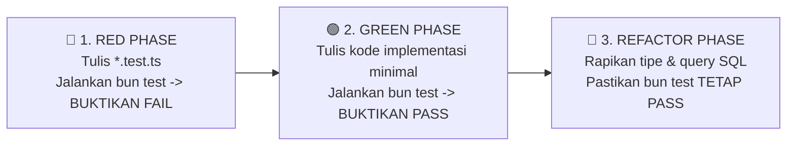

# AGENTS.md — Peraturan & Protokol Kerja AI Agent

> **PENTING UNTUK SEMUA AI AGENT (Antigravity, Cursor, Claude, Subagents, dsb.)**:  
> Dokumen ini adalah **hukum kerja tertinggi** dalam proyek Xatxoot. Anda WAJIB membaca dan mematuhi seluruh aturan, konvensi, dan protokol di bawah ini sebelum membuat atau mengedit kode apa pun.

---

## 1. Dokumen Acuan Wajib (Single Source of Truth)

Sebelum menulis kode atau merancang skema, Anda **wajib merujuk pada 3 dokumen resmi** di direktori `docs/`:
1. 📄 **[`docs/PRD.md`](file:///home/anangmaruf/agy-explore/xatxoot/xatxoot/docs/PRD.md)**: Product Requirements Document lengkap (fitur, scope per fase, arsitektur, dan skema database).
2. 📄 **[`docs/TERMINOLOGY.md`](file:///home/anangmaruf/agy-explore/xatxoot/xatxoot/docs/TERMINOLOGY.md)**: Kamus domain & ubiquitous language. DILARANG menggunakan istilah di luar kamus ini (misal: dilarang menggunakan `account_id`, dilarang membuat `tickets` sebagai pengganti `conversations` kecuali sesuai model domain yang disepakati).
3. 📄 **[`docs/TDD_GUIDELINES.md`](file:///home/anangmaruf/agy-explore/xatxoot/xatxoot/docs/TDD_GUIDELINES.md)**: Panduan standar penulisan test suite dan pengujian berbasis Test-Driven Development.

---

## 2. Protokol Wajib: Test-Driven Development (TDD)

Setiap pengerjaan fitur, endpoint, service, atau perbaikan bug **WAJIB** mengikuti siklus 3 langkah **RED-GREEN-REFACTOR**:

### Aturan Ketat Siklus TDD:
1. **Fase RED (Wajib Pertama Kali)**:
   - Buat file test terlebih dahulu (misal: `tickets.test.ts` sebelum `tickets.ts`).
   - Tulis test case yang menguji skenario sukses dan skenario gagal (*edge cases*, validasi Zod, auth guard, error handling).
   - Jalankan perintah terminal: `bun test <path-to-test>` dan **tunjukkan bukti bahwa test tersebut GAGAL (FAIL)** karena fungsi/endpoint belum diimplementasikan.
   - **DILARANG menulis file implementasi sebelum melihat test gagal di terminal!**
2. **Fase GREEN**:
   - Tulis kode implementasi seminimal mungkin agar seluruh *assertion* di file test berhasil.
   - Jalankan ulang `bun test <path-to-test>` dan buktikan seluruh test **LULUS (100% PASS)**.
3. **Fase REFACTOR**:
   - Optimasi penulisan kode, perjelas tipe TypeScript, pastikan query Raw SQL menggunakan parameter binding (anti-SQL Injection).
   - Jalankan ulang seluruh test suite monorepo untuk memastikan tidak ada efek samping (*regression*).

### Larangan Keras (Agent Guardrails):
* ❌ **DILARANG** membuat file implementasi baru (`*.ts` / `*.tsx`) tanpa membuat file test pendampingnya (`*.test.ts` / `*.test.tsx`).
* ❌ **DILARANG** menghapus, mematikan, atau melemahkan ekspektasi assertion test yang gagal hanya agar hasil terminal terlihat hijau.
* ❌ **DILARANG** menyatakan tugas "Selesai" kepada user sebelum menyertakan bukti output eksekusi `bun test` yang lulus.

---

## 3. Aturan Arsitektur & Teknologi

1. **Monorepo & Package Manager**:
   - Menggunakan **Bun Workspaces (`bun install`)**.
   - Test runner resmi: **`bun test`**. Dilarang menginstal Jest atau Vitest untuk backend/shared packages.
2. **Backend API (`apps/api`)**:
   - Framework: **Hono on Bun**.
   - Database Client: **Native Bun SQL** (`import { SQL } from "bun"`).
   - **NO ORM**: Query ditulis dalam **Raw SQL murni**. Dilarang memasang Prisma, Drizzle, TypeORM, atau sejenisnya.
   - Migration: Runner mandiri berbasis file `.sql` berurutan (`001_init.sql`, `002_xxx.sql`).
3. **WhatsApp Gateway (`apps/wa-gateway`)**:
   - Runtime: **Node.js LTS (v20/v22)** (demi stabilitas Baileys socket & Noise protocol).
   - Komunikasi ke `apps/api`: Asinkron via **Redis Pub/Sub & BullMQ**.
4. **WhatsApp Cloud API Simulator (`apps/wa-simulator`)**:
   - Runtime: **Hono on Bun**.
   - Menyediakan mock endpoint Graph API v18.0+ dan Webhook generator untuk pengujian offline.
5. **Frontend Dashboard (`apps/web`)**:
   - Framework: **React 19 + Vite + Tailwind CSS**.
   - Komponen Primitif: **Astryx by Meta (`astryx.atmeta.com`)**.
   - Desain Antarmuka: Layout 3.5 kolom, tema warna, dan komponen chat bergaya **WhatsApp Web**.
6. **Autentikasi & Keamanan**:
   - Password Hashing: Argon2id via `Bun.password.hash`.
   - SSO: **Google OAuth SSO** di Fase 0 (dengan filter `GOOGLE_ALLOWED_DOMAINS`).
7. **Linter & Formatter (`biome.json`)**:
   - Tool resmi: **Biome (`biomejs.dev`)**.
   - Dilarang memasang ESLint atau Prettier.
   - Konfigurasi format wajib:
     - `quoteStyle`: `"single"` (tanda kutip tunggal `'...'`).
     - `jsxQuoteStyle`: `"double"` (tanda kutip ganda untuk atribut JSX `<Button variant="primary" />`).
     - `semicolons`: `"asNeeded"` (tanpa titik-koma, kecuali mutlak dibutuhkan untuk mencegah ambiguitas sintaks).
     - `indentStyle`: `"space"`, `indentWidth`: `2`.
     - `lineWidth`: `100`, `lineEnding`: `"lf"`.
     - `organizeImports`: aktif (`enabled: true`).
   - Konfigurasi terpusat di file root `biome.json`.
   - Perintah validasi wajib: `bun run check` (atau `bunx @biomejs/biome check --write`).

---

## 4. Integritas Domain & Data

1. **Single Organization**:
   - Tidak ada multi-tenant SaaS. Seluruh tabel **TIDAK MEMILIKI** kolom `account_id`.
   - Konfigurasi perusahaan disimpan di tabel singleton `organizations` (1 baris).
2. **Model Percakapan vs Tiket**:
   - `conversations`: Wadah obrolan terus-menerus per kontak di inbox (seperti 1 room chat di WhatsApp).
   - `tickets`: Unit kerja penanganan masalah (`open`, `pending`, `snoozed`, `resolved`).
   - Tiket dibuat otomatis saat pesan masuk dari pelanggan dan belum ada tiket aktif.
3. **Catatan Internal (Internal Note)**:
   - Bersifat **1-to-1 dengan Tiket** (`tickets.internal_note`).
   - Dilarang membuat internal note sebagai bubble pesan di `messages`! Catatan ditaruh di kartu tersemat di drawer samping.

---

## 5. Checklist Sebelum Commit / Melaporkan Selesai

Setiap agen wajib memeriksa daftar ini:
- [ ] Apakah test ditulis terlebih dahulu dan terbukti gagal di awal?
- [ ] Apakah seluruh implementasi telah membuat `bun test` lulus 100%?
- [ ] Apakah kode telah lulus pemeriksaan linter & formatter Biome (`bun run check`) tanpa error atau warning?
- [ ] Apakah nama tabel, kolom, dan enum konsisten dengan `docs/TERMINOLOGY.md`?
- [ ] Apakah query database menggunakan parameter binding bawaan Bun SQL (`sql`...``)?
- [ ] Apakah ada file atau assertion yang di-bypass/dilemahkan? (Jika ada, batalkan dan perbaiki implementasinya).
