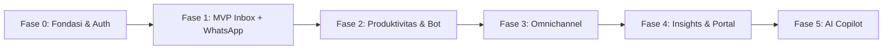

# 💬 Xatxoot

> **Open-Source, Self-Hosted Omnichannel Customer Engagement Platform (WhatsApp-First)**  
> Dibangun dari nol dengan arsitektur modern berkinerja tinggi, hemat sumber daya, dan ramah AI Agent.

---

## 🌟 Fitur & Keputusan Arsitektur Utama

- **🟢 WhatsApp-First Omnichannel**:
  - **WhatsApp Dual-Provider**: Dukungan resmi via Meta Cloud API Graph v18.0+ dan unofficial via Baileys Multi-Device (diisolasi di microservice Node.js LTS).
  - Website Live Chat Widget (< 80 KB gzipped) & API Channel.
  - Multi-channel terpadu: Email, Telegram, Facebook, Instagram, SMS.
- **⚡ Ultra-Fast & Resource-Efficient Tech Stack**:
  - **Backend**: [Hono](https://hono.dev/) on [Bun](https://bun.sh/) dengan native Bun SQL (Raw SQL, tanpa ORM). Memory footprint API < 60 MB RAM.
  - **Frontend**: [React 19](https://react.dev/) + [Vite](https://vite.dev/) + [Tailwind CSS](https://tailwindcss.com/) + [Astryx](https://astryx.atmeta.com/) component primitives, dengan tata letak & tema khas **WhatsApp Web**.
  - **Linter & Formatter**: [Biome](https://biomejs.dev/) — 1 binary Rust all-in-one ultra-cepat (< 1s) menggantikan ESLint dan Prettier.
- **🏢 Single Organization Architecture**:
  - Dirancang khusus untuk self-host instansi / perusahaan mandiri. Tidak ada beban multi-tenant SaaS (bebas dari kolom `account_id` di seluruh tabel).
- **🎯 Pemisahan Domain Presisi**:
  - `Conversation`: Wadah obrolan terus-menerus per kontak di inbox.
  - `Ticket`: Unit kerja operasional penanganan masalah (`open`, `pending`, `snoozed`, `resolved`).
  - **1:1 Sticky Internal Note**: Catatan internal per tiket tersimpan di drawer samping (bukan bubble chat) demi mencegah risiko kebocoran ke pelanggan.
- **🤖 Produktivitas & Otomasi Alur**:
  - Visual flow-based chatbot engine (drag-and-drop node graph, HTTP request, handoff).
  - External slash commands (`/api/command`), canned responses, deadline timer per tiket.
- **🛡️ Protokol AI Agent & Test-Driven Development (TDD)**:
  - Seluruh modul dikembangkan dengan siklus ketat **RED-GREEN-REFACTOR** berbasis `bun test`.

---

## 📚 Dokumentasi Acuan

Seluruh spesifikasi teknis dan aturan operasional tercatat di direktori [`docs/`](docs/):

1. 📄 **[`docs/PRD.md`](docs/PRD.md)**: Product Requirements Document lengkap (arsitektur, perbandingan Chatwoot, roadmap 6 fase, dan skema database PostgreSQL 16 di Lampiran C).
2. 📄 **[`docs/TERMINOLOGY.md`](docs/TERMINOLOGY.md)**: Kamus domain & ubiquitous language resmi (mencegah ambiguitas istilah domain).
3. 📄 **[`docs/TDD_GUIDELINES.md`](docs/TDD_GUIDELINES.md)**: Panduan standar penulisan test suite berbasis `bun test` di 4 tingkatan pengujian.
4. 📄 **[`AGENTS.md`](AGENTS.md)**: Hukum kerja wajib untuk semua AI coding agent (Antigravity, Cursor, Claude, subagents).

---

## 🗺️ Roadmap Pengembangan

---

## 📄 Lisensi

Open-source di bawah lisensi MIT.
