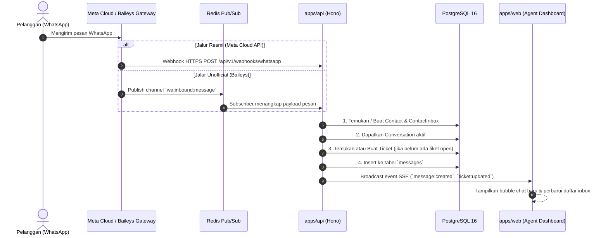
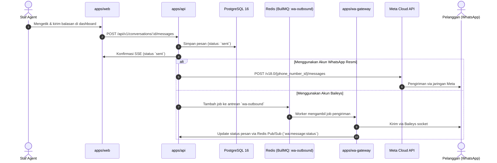

# Arsitektur Sistem — Xatxoot

> **System Architecture & Technical Specifications**  
> Dokumen ini menjelaskan topologi layanan, aliran data (*data flow*), pemisahan tanggung jawab microservice, dan alokasi port lokal untuk proyek **Xatxoot**.

---

## 1. Ikhtisar Topologi Monorepo

Xatxoot dibangun menggunakan pola **modular monorepo** dengan manajer paket **Bun Workspaces**.

```mermaid
flowchart TB
    subgraph Clients["Klien & Antarmuka"]
        WEB["apps/web\n(React 19 + Vite + Tailwind)\nPort: 5173"]
        WIDGET["packages/widget\n(Website Live Chat Widget)\n< 80 KB gzipped"]
        SIM_UI["apps/wa-simulator UI\n(Mock WhatsApp Cloud)\nPort: 3002"]
    end

    subgraph CoreServices["Layanan Inti Backend"]
        API["apps/api\n(Hono on Bun + Bun SQL)\nPort: 3000"]
        GATEWAY["apps/wa-gateway\n(Node.js LTS v20/v22 + Baileys)\nPort: 3001"]
        SIMULATOR["apps/wa-simulator API\n(Hono on Bun)\nPort: 3002"]
    end

    subgraph DataStore["Penyimpanan & Message Broker"]
        PG[("PostgreSQL 16\n(Raw SQL + Migration Runner)\nPort: 5432")]
        REDIS[("Redis 7\n(Pub/Sub & BullMQ)\nPort: 6379")]
    end

    subgraph External["Jaringan Eksternal"]
        META["Meta Graph API v18.0+\n(WhatsApp Cloud Resmi)"]
        WA_NET["WhatsApp Network / Mobile Socket\n(Unofficial Baileys)"]
    end

    %% Koneksi Web & Widget
    WEB -->|"REST API / SSE (Realtime)"| API
    WIDGET -->|"Public API (Chat Widget)"| API

    %% Koneksi Core ke DataStore
    API -->|"Native Bun SQL (Raw SQL)"| PG
    API <-->|"BullMQ Producer/Consumer & Pub/Sub"| REDIS

    %% Koneksi Gateway WhatsApp
    GATEWAY <-->|"Redis Pub/Sub (Event) & BullMQ (Job)"| REDIS
    GATEWAY <-->|"Socket Multi-Device (Noise Protocol)"| WA_NET

    %% Koneksi Cloud API
    API <-->|"HTTPS Webhook & REST Send Message"| META
    API <-->|"HTTPS Mock Webhook & REST (Dev Mode)"| SIMULATOR


---

## 2. Struktur Direktori Monorepo

```text
xatxoot/
├── apps/
│   ├── api/                   # Hono on Bun: REST API, Auth, Tickets, SSE, Background Workers
│   │   ├── migrations/        # File migrasi raw SQL berurutan (001_init.sql, 002_xxx.sql)
│   │   ├── src/
│   │   │   ├── db/            # Native Bun SQL connection pool & query helpers
│   │   │   ├── middlewares/   # Auth guard, rate limit, error handler, CORS
│   │   │   ├── modules/       # Domain modules: auth, inboxes, conversations, tickets, messages
│   │   │   ├── services/      # Business logic: queue, realtime (SSE), notification
│   │   │   └── index.ts       # Entrypoint server Hono
│   │   └── package.json
│   ├── web/                   # Frontend Dashboard (React 19 + Vite + Tailwind + Astryx)
│   │   ├── src/
│   │   │   ├── components/    # WhatsApp Web-style layout, sticky notes, chat bubbles
│   │   │   ├── hooks/         # Custom hooks, realtime SSE listener
│   │   │   ├── pages/         # Auth, Inbox (3.5 kolom), Settings, Contacts
│   │   │   └── main.tsx
│   │   └── package.json
│   ├── wa-gateway/            # Microservice WhatsApp Unofficial (Node.js LTS v20/v22 + Baileys)
│   │   ├── src/
│   │   │   ├── session/       # Baileys auth state handler (file/redis session)
│   │   │   ├── queue/         # BullMQ worker untuk pengiriman pesan outbound
│   │   │   ├── pubsub/        # Redis pub/sub publisher untuk event inbound & QR code
│   │   │   └── index.ts
│   │   └── package.json
│   └── wa-simulator/          # Mock server Meta Graph API v18.0+ untuk offline testing & dev
│       ├── src/
│       └── package.json
├── packages/
│   ├── shared/                # Tipe data TypeScript, skema Zod, konstanta domain
│   └── widget/                # Website Live Chat Widget embeddable (< 80 KB)
├── docs/                      # Dokumentasi resmi (PRD, TERMINOLOGY, TDD, ARCHITECTURE, dll.)
├── biome.json                 # Konfigurasi linter & formatter tunggal (Biome)
├── docker-compose.dev.yml     # PostgreSQL 16 & Redis 7 untuk lingkungan lokal
├── package.json               # Root workspaces configuration
└── tsconfig.base.json         # Konfigurasi TypeScript dasar
```

---

## 3. Keputusan Runtime: Bun vs Node.js

| Komponen | Runtime | Alasan Pemilihan |
|---|---|---|
| `apps/api` | **Bun (v1.1+)** | Start-up ultra cepat, memory footprint rendah (< 60 MB RAM), native Bun SQL driver tanpa overhead libpq C bindings, built-in test runner (`bun test`). |
| `apps/wa-simulator` | **Bun (v1.1+)** | Ringan, cepat, mock server berbasis Hono. |
| `apps/wa-gateway` | **Node.js LTS (v20/v22)** | Library `@whiskeysockets/baileys` sangat bergantung pada modul native Node.js (`crypto`, `ws`, socket TCP buffer, Noise protocol). Dijalankan di Node.js terisolasi demi mencegah ketidakstabilan koneksi socket Baileys di Bun. |
| `apps/web` | Browser (Vite dev) | SPA modern React 19 dengan Fast Refresh Vite. |

---

## 4. Alur Data (Data Flow)

### 4.1 Pesan Masuk (Inbound Message Flow)



---

### 4.2 Pesan Keluar (Outbound Message Flow)



---

## 5. Arsitektur Database & Migrasi

1. **Native Bun SQL**:
   - Menggunakan `import { SQL } from "bun"`.
   - Wajib menggunakan sintaks template literals bawaan Bun SQL (`await sql`SELECT ... WHERE id = ${id}``) yang otomatis mengaktifkan *parameterized query* (anti-SQL Injection).
   - **Tanpa ORM**: Dilarang memasang Prisma, Drizzle, atau TypeORM untuk menjaga performa raw dan efisiensi memori.
2. **Migration Runner Mandiri**:
   - Dikelola oleh script sederhana di `apps/api/src/db/migrate.ts`.
   - File migrasi disimpan secara sekuensial di `apps/api/migrations/` (format: `001_init.sql`, `002_add_campaigns.sql`).
   - Riwayat migrasi dicatat dalam tabel `schema_migrations`.
3. **Single Organization Paradigm**:
   - Seluruh tabel tidak memiliki `account_id`.
   - Konfigurasi perusahaan berada di tabel `organizations` yang hanya memiliki 1 baris (*singleton*).

---

## 6. Pemetaan Port & Jaringan Lokal

| Layanan | Protokol | Port Lokal | Deskripsi |
|---|---|---|---|
| `apps/api` | HTTP / SSE | **3000** | Backend REST API & Realtime Server |
| `apps/wa-gateway` | HTTP / WebSocket | **3001** | Baileys Gateway Controller & Healthcheck |
| `apps/wa-simulator` | HTTP | **3002** | Mock Meta Graph API & Webhook Simulator |
| `apps/web` | HTTP | **5173** | Vite React Dev Server |
| `PostgreSQL` | TCP (SQL) | **5432** | Database Utama (PostgreSQL 16) |
| `Redis` | TCP | **6379** | Pub/Sub Event Broker & BullMQ Queue |
