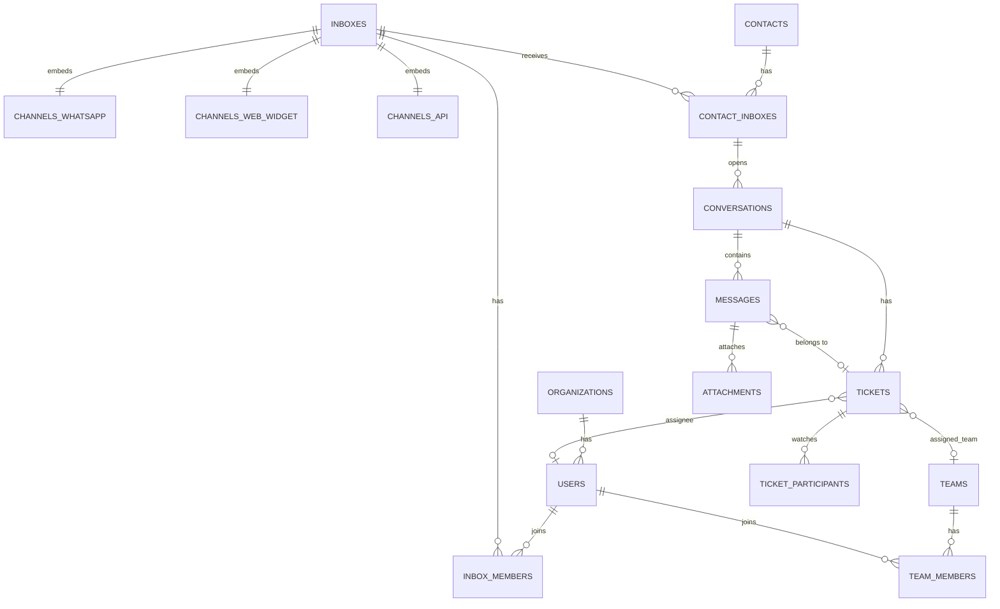

# Skema Database — Xatxoot

> **PostgreSQL 16 Database Schema & Data Dictionary**  
> Dokumen ini adalah acuan resmi struktur database, tabel, kolom, tipe data, dan relasi antartabel untuk proyek **Xatxoot**.

---

## 1. Prinsip & Konvensi Desain Database

1. **Single Organization Architecture**:
   - Seluruh tabel **TIDAK MEMILIKI** kolom `account_id` atau konsep multi-tenant SaaS.
   - Konfigurasi perusahaan disimpan di tabel singleton `organizations` (tepat 1 baris).
2. **Native Bun SQL & No ORM**:
   - Query dieksekusi dengan Raw SQL murni via `import { SQL } from "bun"`.
   - Wajib menggunakan parameterized queries (`sql`SELECT ... WHERE id = ${id}``).
3. **Standar Tipe Data**:
   - Primary Key: `UUID` (`gen_random_uuid()`) atau Auto-Increment untuk `display_id`.
   - Tanggal & Waktu: `TIMESTAMPTZ` (selalu menyimpan zona waktu UTC).
   - Data Fleksibel / Metadata: `JSONB`.
   - String: `VARCHAR` dengan batas atau `TEXT` untuk konten dinamis.
4. **Pemisahan `conversations` dan `tickets`**:
   - `conversations`: Wadah obrolan abadi per kontak di suatu inbox.
   - `tickets`: Unit kerja penanganan isu (`open`, `pending`, `snoozed`, `resolved`).
   - `tickets.internal_note`: Catatan internal tim tersimpan 1:1 di baris tiket.

---

## 2. Diagram Relasi Entitas (ERD)

---

## 3. Tabel Inti: Fase 0 & Fase 1 (Fondasi & MVP WhatsApp)

| Tabel | Kolom Kunci & Tipe | Deskripsi & Aturan |
|---|---|---|
| **`organizations`** | `id UUID PK, name VARCHAR, logo_url TEXT, default_locale VARCHAR, timezone VARCHAR, settings JSONB, created_at TIMESTAMPTZ` | Singleton profil instansi (selalu tepat 1 baris). |
| **`instance_configs`** | `key VARCHAR PK, value TEXT, is_secret BOOLEAN` | Konfigurasi server & integrasi lingkungan (SMTP, S3, TLS). |
| **`users`** | `id UUID PK, email VARCHAR UNIQUE, password_hash TEXT, google_id VARCHAR UNIQUE, display_name VARCHAR, role VARCHAR, custom_role_id UUID, availability VARCHAR, avatar_url TEXT, ui_settings JSONB, mfa_secret TEXT, active BOOLEAN, created_at TIMESTAMPTZ` | Akun operator, staf agent, dan administrator. |
| **`user_sessions`** | `id UUID PK, user_id UUID FK, refresh_token_hash TEXT, user_agent TEXT, ip_address VARCHAR, expires_at TIMESTAMPTZ` | Pelacakan sesi login aktif dan token refresh. |
| **`teams`** | `id UUID PK, name VARCHAR, description TEXT, allow_auto_assign BOOLEAN` | Kelompok spesialisasi agent (Customer Support, Billing, Sales). |
| **`team_members`** | `id UUID PK, team_id UUID FK, user_id UUID FK` | Pemetaan anggota agent ke tim terkait. |
| **`inboxes`** | `id UUID PK, name VARCHAR, channel_type VARCHAR, channel_id UUID, enable_auto_assign BOOLEAN, greeting_enabled BOOLEAN, greeting_message TEXT, working_hours_enabled BOOLEAN, working_hours JSONB, out_of_office_message TEXT, lock_to_single_conv BOOLEAN, sender_name_type VARCHAR` | Pintu masuk pesan yang menghubungkan Channel ke Agent. |
| **`inbox_members`** | `id UUID PK, inbox_id UUID FK, user_id UUID FK` | Hak akses agent untuk menangani percakapan di inbox. |
| **`channels_whatsapp`** | `id UUID PK, provider VARCHAR, phone_number VARCHAR, waba_id VARCHAR, phone_number_id VARCHAR, access_token_enc TEXT, app_secret_enc TEXT, webhook_verify_token VARCHAR, session_data_enc TEXT, connection_status VARCHAR, quality_rating VARCHAR, messaging_tier VARCHAR` | Akun WhatsApp resmi (Meta Cloud API) maupun unofficial (Baileys). |
| **`channels_web_widget`** | `id UUID PK, website_token VARCHAR UNIQUE, website_url TEXT, widget_color VARCHAR, reply_time VARCHAR, pre_chat_form_enabled BOOLEAN, hmac_secret TEXT` | Konfigurasi Live Chat Widget website. |
| **`channels_api`** | `id UUID PK, webhook_url TEXT, auth_token VARCHAR` | Saluran pesan API kustom pihak ketiga. |
| **`companies`** | `id UUID PK, name VARCHAR, domain VARCHAR, description TEXT, custom_attributes JSONB` | Entitas korporat / bisnis kontak (kebutuhan B2B). |
| **`contacts`** | `id UUID PK, company_id UUID FK, name VARCHAR, email VARCHAR, phone_number VARCHAR, identifier VARCHAR, contact_type VARCHAR, custom_attributes JSONB, additional_attributes JSONB, blocked BOOLEAN` | Profil pelanggan / kontak luar. |
| **`contact_inboxes`** | `id UUID PK, contact_id UUID FK, inbox_id UUID FK, source_id VARCHAR, hmac_verified BOOLEAN` | Identitas unik kontak pada inbox tertentu (misal: nomor WA format E.164 atau cookie token). |
| **`conversations`** | `id UUID PK, inbox_id UUID FK, contact_inbox_id UUID FK, active_ticket_id UUID, last_message_at TIMESTAMPTZ, created_at TIMESTAMPTZ, updated_at TIMESTAMPTZ` | Ruang obrolan abadi per kontak di suatu inbox. |
| **`tickets`** | `id UUID PK, display_id BIGINT, conversation_id UUID FK, assignee_id UUID FK, team_id UUID FK, status VARCHAR, priority VARCHAR, snoozed_until TIMESTAMPTZ, waiting_since TIMESTAMPTZ, deadline_at TIMESTAMPTZ, first_reply_created_at TIMESTAMPTZ, opened_at TIMESTAMPTZ, resolved_at TIMESTAMPTZ, internal_note TEXT, internal_note_updated_by UUID FK, internal_note_updated_at TIMESTAMPTZ, custom_attributes JSONB` | Unit kerja operasional penanganan isu beserta **1:1 Sticky Internal Note**. |
| **`ticket_participants`** | `id UUID PK, ticket_id UUID FK, user_id UUID FK` | Rekan kerja yang di-@mention atau memantau (*watcher*) tiket. |
| **`messages`** | `id UUID PK, conversation_id UUID FK, ticket_id UUID FK, sender_type VARCHAR, sender_id UUID, message_type VARCHAR, content TEXT, content_type VARCHAR, status VARCHAR, source_id VARCHAR, content_attributes JSONB, created_at TIMESTAMPTZ` | Riwayat pesan chat (inbound, outbound, activity, template). |
| **`attachments`** | `id UUID PK, message_id UUID FK, file_type VARCHAR, file_url TEXT, thumb_url TEXT, file_size BIGINT, file_name VARCHAR, metadata JSONB` | Berkas media yang diunggah / diterima dalam pesan. |
| **`labels`** | `id UUID PK, name VARCHAR UNIQUE, color VARCHAR, description TEXT, show_on_sidebar BOOLEAN` | Tag klasifikasi tiket dan kontak. |
| **`ticket_labels`** | `id UUID PK, ticket_id UUID FK, label_id UUID FK` | Relasi tag pada tiket. |
| **`contact_labels`** | `id UUID PK, contact_id UUID FK, label_id UUID FK` | Relasi tag pada kontak. |
| **`canned_responses`** | `id UUID PK, short_code VARCHAR UNIQUE, content TEXT` | Balasan cepat terpola menggunakan pintasan `/shortcode`. |
| **`notifications`** | `id UUID PK, user_id UUID FK, notification_type VARCHAR, primary_actor_type VARCHAR, primary_actor_id UUID, read_at TIMESTAMPTZ` | Notifikasi in-app untuk agent. |
| **`notification_settings`** | `id UUID PK, user_id UUID FK, selected_email_flags JSONB, selected_push_flags JSONB` | Konfigurasi preferensi penerimaan notifikasi. |
| **`custom_attribute_definitions`** | `id UUID PK, attribute_key VARCHAR UNIQUE, attribute_model VARCHAR, display_name VARCHAR, display_type VARCHAR, default_value TEXT, regex_pattern TEXT, required BOOLEAN` | Definisi kolom dinamis buatan pengguna. |
| **`webhooks`** | `id UUID PK, url TEXT, subscriptions TEXT[], secret VARCHAR, active BOOLEAN` | Langganan webhook keluar (*outgoing webhooks*). |
| **`audit_logs`** | `id UUID PK, user_id UUID FK, action VARCHAR, auditable_type VARCHAR, auditable_id UUID, changes JSONB, ip_address VARCHAR, created_at TIMESTAMPTZ` | Catatan audit aktivitas keamanan & tata kelola data. |

---

## 4. Tabel Tambahan Fase 2 hingga Fase 5

### 4.1 Fase 2: Produktivitas & Otomasi Alur
- **`slash_commands`**: `id UUID PK, name VARCHAR UNIQUE, description TEXT, endpoint_url TEXT, auth_header TEXT`
- **`macros`**: `id UUID PK, name VARCHAR, visibility VARCHAR, created_by UUID FK`
- **`macro_actions`**: `id UUID PK, macro_id UUID FK, action_type VARCHAR, action_payload JSONB`
- **`whatsapp_templates`**: `id UUID PK, waba_template_id VARCHAR, name VARCHAR, language VARCHAR, category VARCHAR, status VARCHAR, components JSONB`
- **`bot_flows`**: `id UUID PK, name VARCHAR, trigger_type VARCHAR, active BOOLEAN, flow_definition JSONB`
- **`bot_sessions`**: `id UUID PK, conversation_id UUID FK, flow_id UUID FK, current_node_id VARCHAR, context_data JSONB`

### 4.2 Fase 3: Omnichannel & CSAT
- **`channels_email`**: `id UUID PK, imap_host VARCHAR, imap_port INT, imap_username VARCHAR, imap_password_enc TEXT, smtp_host VARCHAR, smtp_port INT, smtp_username VARCHAR, smtp_password_enc TEXT`
- **`channels_telegram`**: `id UUID PK, bot_token_enc TEXT, bot_username VARCHAR`
- **`channels_facebook`**: `id UUID PK, page_id VARCHAR, page_access_token_enc TEXT`
- **`channels_instagram`**: `id UUID PK, ig_user_id VARCHAR, ig_access_token_enc TEXT`
- **`channels_sms`**: `id UUID PK, provider_name VARCHAR, account_sid VARCHAR, auth_token_enc TEXT, from_phone_number VARCHAR`
- **`business_hours`**: `id UUID PK, inbox_id UUID FK, timezone VARCHAR, weekly_schedule JSONB, out_of_office_message TEXT`
- **`csat_surveys`**: `id UUID PK, ticket_id UUID FK, contact_id UUID FK, rating INT, feedback_text TEXT, submitted_at TIMESTAMPTZ`

### 4.3 Fase 4: Insight, Help Center & Campaigns
- **`reporting_events`**: `id UUID PK, event_type VARCHAR, conversation_id UUID FK, ticket_id UUID FK, user_id UUID FK, inbox_id UUID FK, value_in_seconds INT, created_at TIMESTAMPTZ`
- **`portals`**: `id UUID PK, name VARCHAR, slug VARCHAR UNIQUE, custom_domain VARCHAR, header_text TEXT, logo_url TEXT`
- **`portal_categories`**: `id UUID PK, portal_id UUID FK, name VARCHAR, slug VARCHAR, description TEXT, position INT`
- **`portal_articles`**: `id UUID PK, category_id UUID FK, author_id UUID FK, title VARCHAR, slug VARCHAR, content_markdown TEXT, status VARCHAR, views_count INT`
- **`automation_rules`**: `id UUID PK, name VARCHAR, event_name VARCHAR, conditions JSONB, actions JSONB, active BOOLEAN`
- **`campaigns`**: `id UUID PK, inbox_id UUID FK, title VARCHAR, message_content TEXT, scheduled_at TIMESTAMPTZ, status VARCHAR, anti_ban_delay_min INT, anti_ban_delay_max INT`
- **`campaign_deliveries`**: `id UUID PK, campaign_id UUID FK, contact_id UUID FK, status VARCHAR, error_message TEXT, sent_at TIMESTAMPTZ`

### 4.4 Fase 5: AI Copilot, SLA, & Enterprise
- **`article_embeddings`**: `id UUID PK, article_id UUID FK, chunk_text TEXT, embedding VECTOR(1536)` (memerlukan `CREATE EXTENSION vector;`)
- **`ai_settings`**: `id UUID PK, provider VARCHAR, api_key_enc TEXT, model_name VARCHAR, temperature NUMERIC, active BOOLEAN`
- **`sla_policies`**: `id UUID PK, name VARCHAR, inbox_id UUID FK, first_response_time_seconds INT, resolution_time_seconds INT`
- **`ticket_sla_statuses`**: `id UUID PK, ticket_id UUID FK, policy_id UUID FK, first_response_deadline TIMESTAMPTZ, resolution_deadline TIMESTAMPTZ, is_breached BOOLEAN`
- **`sso_providers`**: `id UUID PK, provider_type VARCHAR, issuer_url TEXT, client_id VARCHAR, client_secret_enc TEXT, cert_data TEXT`
