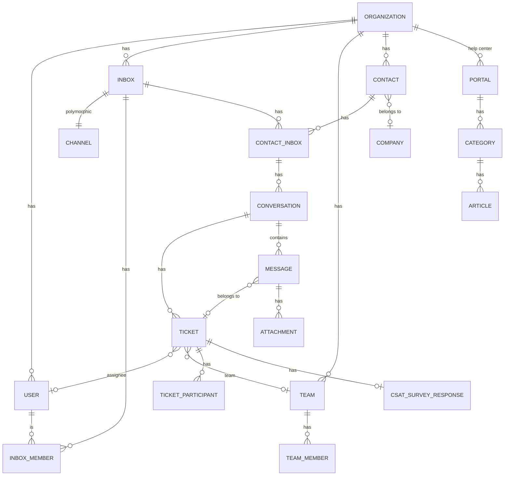
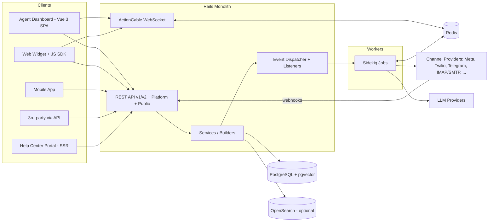
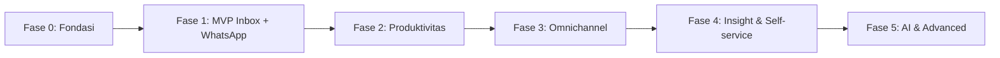
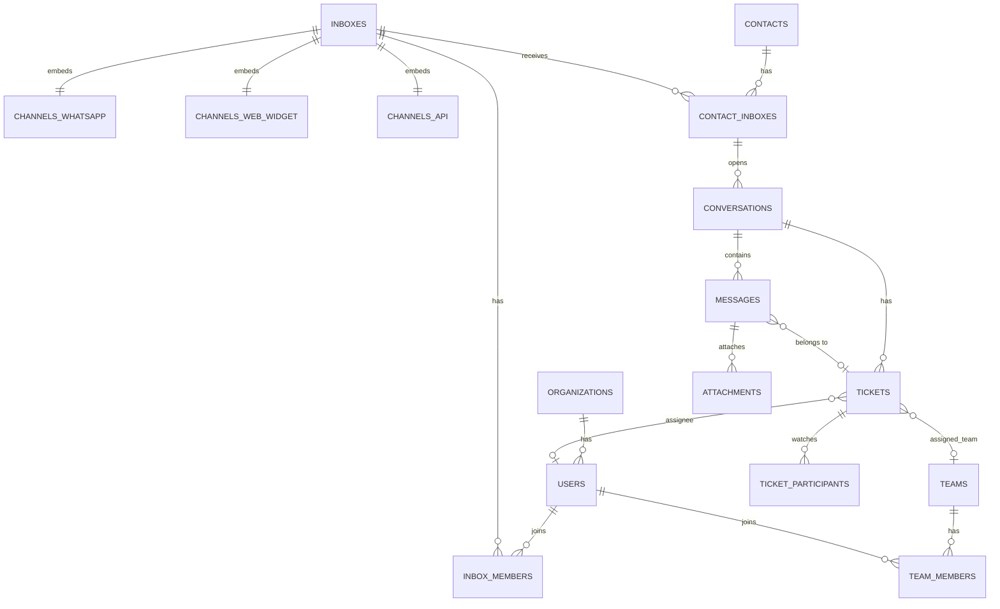

# PRD — Xatxoot

> **Product Requirements Document**
> Diekstrak dari codebase Chatwoot **v4.18.0** (`../chatwoot`) sebagai acuan perilaku & fitur untuk membangun **Xatxoot**.
> Tanggal: 2026-10-09 · Status: Draft v13
>
> **Keputusan kunci** (detail §8.1): (D1) **Rewrite** dari nol · (D2) **Self-host only** · (D3) **WhatsApp = P0** · (D4) **Hono + Bun + Raw Bun SQL + React + Vite** · (D5) **WhatsApp Cloud API + gateway unofficial** · (D6) **Single organization** · (D7) **AI di Fase 5** · (D8) **Design System WhatsApp Web UI/UX + Astryx by Meta** · (D9) **Biome (`biomejs.dev`) linter & formatter**.

---

## 1. Ringkasan Produk

**Xatxoot** adalah platform **omnichannel customer engagement / customer support** open-source dan **self-hosted**, dengan **WhatsApp sebagai channel utama**. Satu dashboard bagi tim support untuk menerima, mengelola, dan membalas percakapan pelanggan dari berbagai channel (WhatsApp, live chat website, email, Facebook, Instagram, Telegram, LINE, SMS, TikTok, X/Twitter, API, dan Voice), lengkap dengan CRM ringan, help center, automation, reporting, dan AI assistant.

### 1.1 Masalah yang Diselesaikan
- Percakapan pelanggan tersebar di banyak aplikasi (terutama banyak HP/WhatsApp Business terpisah) → sulit dilacak, respons lambat.
- Tidak ada konteks pelanggan terpusat (riwayat, atribut, perusahaan).
- Pekerjaan berulang (assign, label, balasan standar) memakan waktu agent.
- Manajer tidak punya visibilitas performa (FRT, resolution time, CSAT, SLA).
- Volume pertanyaan berulang tinggi → butuh self-service (help center) dan AI.
- Bisnis ingin **data percakapan tetap di server sendiri** tanpa biaya langganan per-seat.

### 1.2 Tujuan
| # | Tujuan | Indikator Sukses |
|---|--------|------------------|
| G1 | Unified inbox, WhatsApp-first | WhatsApp + Widget + API stabil di MVP; ≥ 10 channel di akhir roadmap; real-time < 1 detik |
| G2 | Mempercepat respons agent | Penurunan First Response Time (FRT) & Resolution Time |
| G3 | Otomasi pekerjaan berulang | % percakapan ter-assign/terlabel otomatis |
| G4 | Self-service & AI deflection | Bot resolution rate, handoff rate |
| G5 | Mudah di-self-host | Install < 15 menit via `docker compose`; upgrade 1 perintah; jalan di VPS 2 vCPU/4 GB |

### 1.3 Non-Goals (v1)
- Bukan SaaS: **tidak ada billing, subscription, plan/paywall**, atau signup publik multi-tenant ala SaaS.
- Bukan full-blown CRM/sales pipeline (deal, forecasting).
- Bukan marketing automation kompleks (drip email multi-step).
- Bukan helpdesk ticketing berbasis email-only klasik (fokus conversational).
- Tidak memakai/menyalin kode Chatwoot (rewrite murni).

---

## 2. Persona & Peran

| Persona | Deskripsi | Kebutuhan Utama |
|---------|-----------|-----------------|
| **Agent** | Staf support yang membalas percakapan | Inbox cepat, canned response, konteks kontak, notifikasi |
| **Administrator** | Manager tim support | Setup inbox, agent, team, automation, report |
| **Owner** | Administrator pertama (dibuat saat setup) & operator instance self-host | Semua hak admin + menu Instance: konfigurasi, status layanan, upgrade, backup |
| **Custom Role** | Peran granular | Permission terbatas sesuai tugas |
| **End Customer / Visitor** | Pelanggan yang menghubungi | Chat mudah via channel favorit, help center, CSAT |
| **Developer / Integrator** | Membangun integrasi | REST API, webhook, Agent Bot, SDK widget |

### 2.1 Model Permission
- `User.role`: `owner` | `administrator` | `agent` (+ `custom_role_id` opsional). Karena single organization (D6), role disimpan langsung di `User` — tidak perlu tabel `AccountUser`.
- `User.availability`: `online` | `offline` | `busy` (+ auto-offline)
- **Custom Role permissions**:
  `conversation_manage`, `conversation_unassigned_manage`, `conversation_participating_manage`, `contact_manage`, `report_manage`, `knowledge_base_manage`
- Authorization di-enforce via policy per resource (CASL).
- Agent hanya melihat percakapan di inbox tempat ia menjadi member.

### 2.2 Autentikasi & Single Sign-On (SSO)
- **Email & Password**: Hash dengan Argon2id via `Bun.password.hash` dengan session JWT / secure cookie.
- **Google OAuth (SSO Fase 0)**:
  - Tombol *"Masuk dengan Google"* di layar login dashboard web.
  - Konfigurasi via ENV (`GOOGLE_CLIENT_ID`, `GOOGLE_CLIENT_SECRET`, `GOOGLE_CALLBACK_URL`).
  - Opsi pembatasan domain email (mis. hanya `@perusahaan.com`) via `GOOGLE_ALLOWED_DOMAINS` untuk keamanan internal tim.
  - Penautan akun otomatis (*auto-link*) berdasarkan alamat email Google yang terverifikasi ke tabel `users.google_id`.
- **MFA / TOTP**: Multi-Factor Authentication berbasis aplikasi authenticator (Google Authenticator / Authy) dengan recovery codes.
- **Enterprise SSO (Fase 5)**: Protokol SAML 2.0 & OIDC untuk integrasi IdP korporat (Okta, Azure AD / Entra ID, Keycloak).

---

## 3. Konsep Domain Inti

> Diagram di bawah sudah disesuaikan untuk Xatxoot (single organization): entitas `Account`/`AccountUser` Chatwoot diganti `Organization` singleton, dan tabel lain tidak memerlukan `account_id`.



| Entity | Keterangan | Field/Enum Penting |
|--------|-----------|--------------------|
| **Organization** | Singleton (1 baris) — profil & settings instalasi | `name`, `logo`, `locale`, `timezone`, `feature_toggles`, `settings` (auto-resolve, dll.) |
| **User** | Orang yang login | `role`, `custom_role_id`, `availability`, MFA, SSO, `display_name`, signature |
| **Inbox** | Satu titik masuk percakapan, terhubung ke 1 Channel | `enable_auto_assignment`, `greeting`, working hours, out-of-office, `sender_name_type: friendly/professional`, CSAT, `lock_to_single_conversation` |
| **Channel** (polymorphic) | Implementasi per channel | lihat §4.1 |
| **Contact** | Pelanggan | `name, email, phone_number, identifier`, `contact_type: visitor/lead/customer`, `custom_attributes`, `additional_attributes`, blocked |
| **ContactInbox** | Identitas contact di inbox tertentu | `source_id`, `hmac_verified` |
| **Company** | Organisasi pelanggan (B2B) | domain, custom attributes, enrichment |
| **Conversation** | Wadah stream obrolan persisten per Contact di Inbox | `inbox_id`, `contact_inbox_id`, `active_ticket_id`, `last_message_at` |
| **Ticket** | Unit kerja operasional penanganan isu (dibuat otomatis) | `status: open/resolved/pending/snoozed`, `priority: low/medium/high/urgent`, `assignee`, `team`, labels, `deadline_at`, `waiting_since`, `display_id`, custom attributes |
| **Message** | Pesan dalam conversation (opsional terikat ke ticket aktif) | `message_type: incoming/outgoing/activity/template`, `content_type` (text, input_*, cards, form, article, incoming_email, input_csat, integrations, sticker, voice_call), `status: sent/delivered/read/failed`, `private` (note), `content_attributes` (reply-to, deleted, external error) |
| **Attachment** | File pada message | `file_type: image/audio/video/file/location/fallback/share/story_mention/...` |
| **Team** | Grup agent | `allow_auto_assign` |
| **Label** | Tag untuk ticket/contact | warna, `show_on_sidebar` |
| **CustomAttributeDefinition** | Skema atribut kustom | `attribute_model: ticket/contact/company`, `display_type: text/number/currency/percent/link/date/list/checkbox`, regex validation, required |
| **CustomFilter** | Saved filter / custom view | `filter_type: ticket/contact/report` |
| **Mention / Participant** | @mention & watcher pada tiket | memicu notifikasi |
| **Note** | Catatan pada contact/tiket | — |

---

## 4. Functional Requirements

Prioritas: **P0** = MVP wajib · **P1** = penting setelah MVP · **P2** = lanjutan

> [!NOTE]
> Label *premium* di dokumen ini hanya menandai fitur yang di Chatwoot berada di Enterprise/berbayar. Di Xatxoot (self-host, D2) **semua fitur gratis & tersedia**; label tersebut dipakai sebagai penanda kompleksitas dan bahwa fitur harus ditulis independen.

### 4.1 Channel / Inbox (P0–P1)

| Channel | Referensi Chatwoot | Prioritas | Catatan |
|---------|-------|-----------|---------|
| **WhatsApp** | `Channel::Whatsapp` | **P0** | Dua provider: **Cloud API resmi** (§4.1.1) dan **Unofficial gateway / WA Web** (§4.1.2), dipilih per inbox |
| Website Live Chat | `Channel::WebWidget` | **P0** | Widget JS embeddable, pre-chat form, reply time (`in_a_few_minutes/hours/in_a_day`), warna/branding, HMAC identity validation, campaigns |
| API | `Channel::Api` | **P0** | Channel generik via REST + webhook callback |
| Email | `Channel::Email` | P1 | IMAP polling / inbound forwarding, SMTP, Google & Microsoft OAuth, threading, custom reply domain |
| Facebook Messenger | `Channel::FacebookPage` | P1 | OAuth Page, webhook |
| Instagram | `Channel::Instagram` | P1 | DM, story mention/reply |
| Telegram | `Channel::Telegram` | P1 | Bot token |
| SMS | `Channel::Sms`, `Channel::TwilioSms` | P1 | Bandwidth, Twilio (SMS & WhatsApp medium) |
| LINE | `Channel::Line` | P2 | — |
| TikTok | `Channel::Tiktok` | P2 | — |
| X / Twitter | `Channel::TwitterProfile` | P2 | DM & tweet (legacy) |
| Voice | `Call` (Twilio/WhatsApp) | P2 | Inbound/outbound, transkrip, recording |

#### 4.1.1 WhatsApp Cloud API Resmi (P0) — Requirement Detail

**Setup & koneksi**
- FR-WA-1: Admin membuat inbox WhatsApp dengan memasukkan **Phone Number ID, WABA ID, Permanent Access Token, App Secret**; sistem memvalidasi kredensial ke Graph API sebelum menyimpan.
- FR-WA-2: Sistem menampilkan **Webhook Callback URL + Verify Token** unik per inbox untuk dipasang di Meta App; mendukung handshake `hub.challenge`.
- FR-WA-3: Setiap webhook diverifikasi dengan signature `X-Hub-Signature-256` (App Secret).
- FR-WA-4 *(P1)*: **Embedded Signup** (OAuth Meta) sebagai alternatif input manual.
- FR-WA-5: Dokumentasi step-by-step pembuatan Meta App untuk operator self-host.

**Pesan masuk (inbound)**
- FR-WA-6: Terima tipe: text, image, video, audio/voice note, document, sticker, location, contacts, interactive reply (button/list), reaction, reply-to (context).
- FR-WA-7: Media diunduh dari Graph API dan disimpan ke storage lokal/S3 (URL Meta kedaluwarsa).
- FR-WA-8: Idempotensi berdasarkan `wamid` (tidak ada pesan duplikat saat Meta retry).
- FR-WA-9: Contact dibuat/dicocokkan otomatis berdasarkan nomor WA (format E.164) + nama profil.

**Pesan keluar (outbound)**
- FR-WA-10: Kirim text, media (image/video/audio/document), sticker, location, reply-to pesan tertentu, interactive (button/list) dari bot/automation.
- FR-WA-11: **Status pesan** `sent → delivered → read / failed` dari webhook status, ditampilkan di UI beserta pesan error Meta bila gagal.
- FR-WA-12: **24-hour service window**: editor menampilkan sisa waktu window; di luar window, agent hanya dapat mengirim **message template**.

**Message templates (HSM)**
- FR-WA-13: Sinkronisasi template dari WABA (nama, bahasa, kategori, status approval, komponen header/body/button).
- FR-WA-14: Agent memilih template + mengisi variabel (`{{1}}`, media header) untuk memulai/melanjutkan percakapan.
- FR-WA-15 *(P1)*: Membuat/mengajukan template baru dari UI.
- FR-WA-16 *(P1)*: **Broadcast campaign** via template ke segmen contact (label/filter) dengan jadwal, throttling sesuai tier messaging limit, dan laporan per-recipient (sent/delivered/read/failed).

**Lain-lain**
- FR-WA-17: Mark-as-read ke WhatsApp saat agent membuka conversation (opsional per inbox).
- FR-WA-18: Monitoring kesehatan nomor: quality rating & messaging tier ditampilkan di settings inbox.
- FR-WA-19 *(P2)*: WhatsApp Calling API, manual transfer/re-configure nomor.

#### 4.1.1.1 WhatsApp Cloud API Simulator (Dev & Testing Tool)

Modul simulator lokal (`apps/wa-simulator`) untuk mengemulasi Meta Graph API v18.0+ dan webhook secara 100% offline tanpa perlu Meta Developer Account, kartu kredit, maupun tunnel Ngrok saat proses development dan CI/CD.

- **FR-WS-1: Mock Graph API Server**: Menerima request kirim pesan `POST /v18.0/:phoneNumberId/messages` dari backend Xatxoot, memvalidasi format payload, dan mengembalikan response JSON resmi Meta (`wamid.mock_xxx`).
- **FR-WS-2: Automatic Delivery Receipts**: Secara otomatis (dengan configurable delay) mengirimkan rangkaian event webhook status ke Xatxoot: `sent` (1 centang abu) $\rightarrow$ `delivered` (2 centang abu) $\rightarrow$ `read` (2 centang biru).
- **FR-WS-3: Customer Chat Mini-UI**: Antarmuka web mini di browser (port 3005) untuk mengetik pesan pura-pura dari nomor pelanggan, memilih tipe pesan (teks, gambar, tombol interactive), dan mengirimkan webhook resmi Meta lengkap dengan header `X-Hub-Signature-256`.
- **FR-WS-4: Edge-Case & Error Injection**: Kemampuan men-trigger skenario gagal untuk pengujian: simulasi pesan gagal terkirim (error code Meta), simulasi jeda 24 jam kedaluwarsa, dan simulasi network timeout.

#### 4.1.2 WhatsApp Unofficial Gateway (P0) — Requirement Detail

Provider kedua berbasis protokol **WhatsApp Web multi-device** (library **Baileys**), dijalankan sebagai microservice terpisah `apps/wa-gateway` menggunakan runtime **Node.js LTS (v20/v22)**. Penggunaan Node.js menjamin kestabilan koneksi, manipulasi stream/buffer, dan handshake *Noise protocol* yang sering mengalami masalah kestabilan jika dijalankan di Bun. Komunikasi antara `wa-gateway` (Node.js) dan `api` (Bun) dihubungkan secara asinkron melalui antrean Redis Pub/Sub & BullMQ. Cocok untuk UMKM yang belum punya akses WhatsApp Business API / ingin memakai nomor WhatsApp Business App yang sudah ada.

**Abstraksi provider**
- FR-WU-1: Inbox WhatsApp memiliki field `provider: cloud_api | unofficial`. Logika conversation/message/automation **tidak boleh** bergantung pada provider; semua akses lewat interface `WhatsAppProvider` (`sendText`, `sendMedia`, `sendReaction`, `markRead`, `getStatus`, events `message`, `status`, `connection`).
- FR-WU-2: Fitur yang hanya ada di satu provider (mis. template HSM di Cloud API, 24-jam window) di-expose sebagai *capabilities*; UI menyesuaikan otomatis.

**Koneksi & session**
- FR-WU-3: Pairing nomor via **QR code** (live-refresh di UI) atau **pairing code** 8 digit.
- FR-WU-4: Status koneksi real-time: `connecting / connected / disconnected / logged_out`; notifikasi ke admin bila terputus.
- FR-WU-5: Credential session disimpan terenkripsi di DB (bukan file lokal) agar tahan restart & ikut backup.
- FR-WU-6: Auto-reconnect dengan exponential backoff; tombol **logout** & **re-pair**.
- FR-WU-7: Satu proses gateway dapat menangani banyak nomor; komunikasi gateway ↔ api via Redis stream/BullMQ + internal HTTP dengan shared secret.

**Pesan**
- FR-WU-8: Inbound: text, media (image/video/audio/voice note/document/sticker), location, contact card, reply/quote, reaction, pesan dihapus (*revoked*) & diedit.
- FR-WU-9: Outbound: text, media, reply-to, reaction; status `sent → delivered → read` dari receipt.
- FR-WU-10: Pesan yang dikirim langsung dari HP (bukan dari Xatxoot) ikut tersinkron sebagai outgoing message.
- FR-WU-11: Opsi sinkronisasi riwayat chat terbaru saat pairing pertama (konfigurasi jumlah hari, default off).
- FR-WU-12: Pesan grup **diabaikan secara default** (opsi P2 untuk mendukung grup).
- FR-WU-13: Tidak ada batasan 24-jam window maupun template.

**Proteksi anti-ban**
- FR-WU-14: Rate limit pengiriman per nomor (konfigurasi pesan/menit) + jeda acak antar pesan.
- FR-WU-15: Broadcast/campaign via provider unofficial **dinonaktifkan secara default**; jika diaktifkan, wajib throttling ketat dan peringatan risiko.
- FR-WU-16: Saat memilih provider ini, UI menampilkan disclaimer pelanggaran ToS & risiko blokir yang harus dikonfirmasi admin.

**Requirement umum inbox:**
- FR-IN-1: Admin dapat membuat, mengedit, menghapus inbox dan memilih channel.
- FR-IN-2: Admin menentukan agent member inbox (`InboxMember`).
- FR-IN-3: Pengaturan business hours + pesan out-of-office per inbox (timezone aware).
- FR-IN-4: Greeting message otomatis, auto-assignment toggle, CSAT toggle & template.
- FR-IN-5: Opsi "lock to single conversation" (satu thread aktif per contact).
- FR-IN-6: Agent Bot dapat dipasang ke inbox (`AgentBotInbox: active/inactive`).
- FR-IN-7: Reauthorization flow ketika token channel kedaluwarsa (`Reauthorizable`).

### 4.2 Conversation & Ticket Management (P0)

Xatxoot memisahkan kontinuitas ruang obrolan (*Conversation*) dengan unit kerja penanganan masalah (*Ticket*).

- **FR-TK-1: Ticket Auto-Creation & Inbound Binding**: Sistem secara otomatis membuat `Ticket` baru saat pesan masuk dari pelanggan jika belum ada tiket berstatus `open` atau `pending` pada conversation tersebut. Jika tiket sedang berstatus `pending`, pesan baru pelanggan otomatis mengembalikan status tiket ke `open` (agent perlu merespons).
- **FR-TK-2: Ticket Status Lifecycle**: `open → pending → snoozed (until time / next reply) → resolved`. Saat tiket di-resolve oleh agent, ruang chat `Conversation` tetap utuh. Pesan baru di masa mendatang akan otomatis memicu pembuatan tiket baru berikutnya.
- **FR-TK-3: Assignment**: Penugasan tiket ke agent dan/atau team; self-assign; activity message tercatat ("X assigned to Y").
- **FR-TK-4: Priority**: Tingkat urgensi tiket (`low`, `medium`, `high`, `urgent`).
- **FR-TK-5: Labels**: Tagging pada tiket (`ticket_labels`); filter berdasarkan label di sidebar.
- **FR-TK-6: 1:1 Internal Sticky Case Note**: Setiap tiket memiliki tepat 1 catatan internal (`tickets.internal_note`, `internal_note_updated_by`, `internal_note_updated_at`) yang tersemat sebagai kartu ringkasan kasus di Context Drawer kanan atau header tiket. Dapat diedit kolaboratif oleh agent, mendukung Markdown, to-do checklist, dan @mention rekan kerja (memicu notifikasi saat disimpan). Bersih dari kanvas obrolan dan menghilangkan 100% risiko salah kirim catatan ke pelanggan.
- **FR-TK-7: Deadline Timer & Countdown**: Menetapkan batas waktu respon atau penyelesaian tiket (`deadline_at`). UI thread chat menampilkan badge countdown visual khas WhatsApp Web. Bila waktu kedaluwarsa sebelum respon/resolve, sistem memicu eskalasi notifikasi atau penugasan ulang.
- **FR-CV-1: Unified Inbox List**: Daftar percakapan dengan tab *Mine / Unassigned / All*, filter status tiket, sort (latest message, created, priority, waiting since), serta badge status tiket aktif (misal: `#T-102 [Open]`).
- **FR-CV-2: Persistent Chat Canvas**: Seluruh riwayat obrolan terdahulu tetap dapat di-scroll di kanvas doodle WhatsApp Web. Transisi tiket (tiket baru dibuka / tiket diselesaikan) ditandai dengan pill aktivitas di tengah thread.
- **FR-CV-3: Reply Editor**: Rich text (markdown), attachment, emoji, voice recorder, canned response (`/shortcode`), external slash command (`/command`), signature, reply-to message, draft tersimpan.
- **FR-CV-4: Real-time Update**: Update real-time via WebSocket (pesan baru, typing indicator, status centang, status tiket, presence).
- **FR-CV-5: Ticket History di Context Drawer**: Drawer samping kanan menampilkan profil kontak dan seluruh riwayat tiket terdahulu pelanggan (`#T-101 [Resolved]`, `#T-102 [Open]`).
- **FR-CV-6: Advanced Filter & Custom Views**: Filter berdasarkan status tiket, assignee, inbox, team, label, priority, custom attributes, tanggal.
- **FR-CV-7: Bulk Actions**: Assign, label, ubah status banyak tiket sekaligus.
- **FR-CV-8: Auto-resolve**: Tiket diselesaikan otomatis setelah $N$ waktu tidak aktif pelanggan (konfigurasi per organisasi).
- **FR-CV-9: Message Status Delivery**: Jam pending → 1 centang abu (sent) → 2 centang abu (delivered) → 2 centang biru (read) → tanda seru merah bila gagal.
- **FR-CV-10: Keyboard Shortcuts & Command Palette**: Pintasan navigasi cepat (Cmd+K).

### 4.3 Contacts & Companies / CRM ringan (P0–P1)

- FR-CT-1: Daftar contact dengan search, filter, sort, segment (saved filter).
- FR-CT-2: Profil contact: info dasar, social profiles, custom attributes, label, notes, riwayat conversation, attachments.
- FR-CT-3: Create/edit/merge/delete contact; import CSV & export.
- FR-CT-4: Tipe contact otomatis: `visitor → lead → customer`.
- FR-CT-5: **Companies**: entitas perusahaan, relasi contact↔company, enrichment otomatis.
- FR-CT-6: IP lookup & geolokasi (kota, negara) dari sesi widget.
- FR-CT-7: **Data Import** dari platform lain (status: pending/processing/completed/completed_with_errors/failed) dengan mapping & error log.

### 4.4 Productivity Tools (P0–P1)

- FR-PR-1: **Canned Responses** — `short_code` + konten, dipanggil via `/` di editor.
- FR-PR-2: **Macros** — urutan aksi sekali klik (`visibility: personal/global`), mis. label + assign + resolve.
- FR-PR-3: **Custom Attributes** — definisi atribut untuk conversation/contact/company.
- FR-PR-4: **Labels** management.
- FR-PR-5: **Dashboard Apps** — embed iframe app eksternal di sidebar conversation dengan context data.
- FR-PR-6: **Message templates** (WhatsApp) & variabel Liquid (`{{contact.name}}`, dsb).
- FR-PR-7: **External Slash Commands** — Perintah berawalan slash (mis. `/cekresi [no]`, `/order [id]`) di editor chat agent. Sistem memanggil endpoint HTTP webhook eksternal secara asinkron dengan argumen yang diberikan, mem-parsing respons data, dan menyisipkan hasil teks ke dalam draft composer atau mengirimkannya langsung sebagai balasan pesan.

### 4.5 Automation (P1)

**Automation Rules** = *event → conditions → actions*.

- **Events**:
  1. `conversation_created` — percakapan baru dibuat (pesan pertama masuk)
  2. `conversation_updated` — status, assignee, team, atau atribut berubah
  3. `conversation_opened` — percakapan dibuka kembali
  4. `conversation_resolved` — percakapan diselesaikan
  5. `message_created` — setiap pesan baru masuk atau keluar
  6. `monitor_matched` *(Fase 5)* — dipicu oleh AI conversation monitor
- **Conditions**: `content, email, country_code, status, message_type, browser_language, assignee_id, team_id, referer, city, company_name, inbox_id, mail_subject, phone_number, priority, conversation_language, labels, private_note, captain_condition` (Fase 5), + custom attributes. Operator AND/OR.
- **Actions**: `send_message, add_label, remove_label, send_email_to_team, assign_team, assign_agent, remove_assigned_agent, remove_assigned_team, send_webhook_event, mute_conversation, send_attachment, change_status, resolve/open/pending/snooze_conversation, change_priority, send_email_transcript, add_private_note`.
- FR-AU-1: CRUD rule, aktif/nonaktif, clone.
- FR-AU-2: **Delayed automations** — eksekusi tertunda dengan state (`pending/processing/executed/skipped/executing`), dibatalkan bila kondisi berubah.
- FR-AU-3: Rule harus dicegah dari loop tak berujung (guard terhadap aksi yang memicu event yang sama).

### 4.6 Assignment Engine (P1)

- FR-AS-1: **Auto-assignment round-robin** per inbox, hanya agent online.
- FR-AS-2: **Assignment Policy v2**: `conversation_priority: earliest_created/longest_waiting`, `assignment_order: round_robin | balanced`, rate limit per agent.
- FR-AS-3: **Agent Capacity Policy** — batas jumlah conversation aktif per agent per inbox; **leaves** (cuti agent).
- FR-AS-4: Team-based auto assign (`allow_auto_assign`).

### 4.7 Campaigns (P1)

- FR-CP-1: **Ongoing campaign** (website widget) — pesan proaktif berdasarkan URL & waktu di halaman, audiens tertentu.
- FR-CP-2: **One-off campaign** (SMS/WhatsApp) — broadcast terjadwal ke segmen label/audience.
- FR-CP-3: Status campaign `active/processing/completed`; per-recipient status & campaign analytics.

### 4.8 Help Center / Knowledge Base (P1)

- FR-HC-1: **Portal** multi-locale, custom domain, branding (logo, warna, header), multiple portal per organisasi.
- FR-HC-2: **Category** (nested/related) & **Article** (`draft/published/archived`), editor rich text, author, SEO meta, view count.
- FR-HC-3: Halaman publik (SSR) yang dapat diakses tanpa login; search artikel.
- FR-HC-4: Artikel dapat disisipkan ke widget & dikirim sebagai message (`content_type: article`).
- FR-HC-5: Embedding/semantic search (Fase 5, pgvector).

### 4.9 Reports & Analytics (P1)

- **Overview**: jumlah conversation, incoming/outgoing messages, FRT, resolution time, reply time, resolution count — dengan perbandingan periode.
- **Live report**: open/unattended/unassigned conversation real-time, status agent.
- **Breakdown**: per Agent, Inbox, Team, Label.
- **CSAT report**: rating 1–5 / emoji, feedback, review notes.
- **Bot report**: bot resolutions & handoffs.
- **SLA report**: hit/miss FRT, NRT, RT.
- **Year in review**.
- Data dihitung dari `reporting_events` + **rollup harian** (`resolutions_count, first_response, resolution_time, reply_time, bot_resolutions_count, bot_handoffs_count`) per dimensi global/agent/inbox/team.
- Business-hours aware calculation; export CSV.

### 4.10 Notifications (P0)

- Tipe: `conversation_creation, conversation_assignment, assigned_conversation_new_message, conversation_mention, participating_conversation_new_message, sla_missed_first_response, sla_missed_next_response, sla_missed_resolution`.
- Saluran: in-app (notification center), email, web push (VAPID), mobile push (FCM).
- Preference per user per tipe (`NotificationSetting`); snooze/mark read.

### 4.11 CSAT Survey (P1)

- Dikirim otomatis saat conversation resolved (bila diaktifkan per inbox).
- Rating + komentar; halaman survey publik; template CSAT kustom (WhatsApp template utility).

### 4.12 SLA (P2)

- SLA Policy: `first_response_time_threshold`, `next_response_time_threshold`, `resolution_time_threshold`, `only_during_business_hours`.
- Diterapkan via automation/manual → `AppliedSla` (`active/hit/missed/active_with_misses`) + `SlaEvent` (`frt/nrt/rt`); badge countdown di conversation & notifikasi missed.

### 4.13 AI Assistant & Copilot (Fase 5, P2 — Keputusan D7)

> **Catatan Fase 5**: AI bukan bagian MVP. Dirancang menggunakan arsitektur **BYO Key (Bring Your Own Key)** langsung dari operator self-host (OpenAI, Anthropic Claude, Google Gemini, Groq, atau model lokal via Ollama/vLLM) dengan **pgvector** di PostgreSQL untuk document retrieval (RAG).

- **AI Assistant**: nama, persona prompt, guardrails, response guidelines; dapat dipasang ke inbox sebagai tier-1 support bot.
- **Knowledge Sources (RAG)**: Dokumen teks/PDF, URL crawl, FAQ yang diapprove (`AssistantResponse`), saran FAQ dari chat (`open/approved/dismissed`).
- **Scenarios & Tools**: instruksi skenario kontekstual + **Custom HTTP Tools** (GET/POST/PUT/PATCH/DELETE dengan Bearer/API Key).
- **Handoff**: deteksi eskalasi ke agent manusia dengan pencatatan kategori alasan handoff & conversation outcome.
- **Copilot (Agent Assistant)**: tombol one-click di editor untuk draft reply, rewrite (friendly, formal, concise), grammar correction, translate pesan, ringkasan percakapan panjang.
- **Playground**: sandbox untuk menguji respon assistant sebelum live.
- **Conversation Monitors**: evaluasi percakapan otomatis oleh LLM (termasuk deteksi sentimen, CSAT prediktif) yang memicu event `monitor_matched` di Automation Rules.

### 4.14 Integrations (P1–P2)

| Integrasi | Fungsi |
|-----------|--------|
| **Webhooks** | Events: `conversation_created/updated/status_changed, contact_created/updated, message_created/updated, webwidget_triggered, inbox_created/updated, conversation_typing_on/off`; HMAC signature |
| **Agent Bots** | Bot eksternal via webhook (mis. Rasa, custom webhook bot) |
| **Dialogflow** | Bot NLU |
| **Slack** | Notifikasi & balas percakapan langsung dari thread Slack |
| **Google Translate** | Terjemahkan pesan masuk/keluar |
| **Dashboard Apps** | Embed iframe aplikasi internal/eksternal di sidebar conversation |
| **Linear** | Buat & tautkan issue tiket engineering langsung dari percakapan |
| **Notion** | Sumber artikel knowledge base |
| **Shopify** | Tampilkan profil customer, riwayat pesanan & status pengiriman |
| **Stripe** | Tampilkan status langganan & invoice customer di sidebar (bukan billing Xatxoot) |
| **Dyte** | Video call dengan customer langsung dari conversation |

### 4.15 Flow-Based Chatbot Engine (P1 — Fase 2)

Bot deterministik berbasis alur graf keputusan (decision-tree / state machine) untuk melayani percakapan garis depan (tier-1) sebelum AI LLM Fase 5 diperkenalkan (mengadopsi arsitektur modular dari NusaContact `internal/bot`).

- **FR-FB-1: Visual Flow Builder & Schema**: Mengelola alur percakapan berbasis graph/node: *Trigger* (`conversation_created`, kata kunci pesan pertama, atau binding inbox), *Steps* (tindakan), dan *Transitions/Edges* (perpindahan antar step).
- **FR-FB-2: Node Step Types**:
  - `send_message`: Kirim teks, gambar, video, dokumen, atau WhatsApp Interactive (quick reply button / menu list).
  - `user_input`: Menunggu input balasan pelanggan, validasi tipe (teks bebas, angka/pilihan menu, email, nomor HP), dan menyimpan nilai ke variabel sesi bot.
  - `branch_condition`: Percabangan logika IF/ELSE berdasarkan jawaban user, custom attributes kontak, atau jam operasional.
  - `http_request`: Eksekusi webhook REST API (GET/POST/PUT) ke sistem eksternal dengan dynamic interpolasi (`{{input}}`, `{{contact.name}}`), parsing JSON respons, dan penyimpanan hasil ke variabel flow untuk ditampilkan di pesan berikutnya.
  - `update_attribute`: Otomatis perbarui atribut custom kontak atau percakapan dari input pengguna.
  - `assign_agent_or_team`: Handoff percakapan ke agent atau Team tertentu, mengubah status percakapan ke `open`, dan menghentikan eksekusi bot.
  - `end_flow`: Mengakhiri alur percakapan bot atau menandai percakapan sebagai `resolved`.
- **FR-FB-3: Session & State Tracking**: Pelacakan posisi step aktif per percakapan (`bot_flow_sessions`), timeout ketidakaktifan dengan fallback pesan, dan batas maksimal salah input (*max retry attempts*) sebelum otomatis eskalasi ke staf manusia.
- **FR-FB-4: Inbox Binding & Priority**: Mengaitkan flow bot ke satu atau lebih inbox sebagai gatekeeper tier-1 otomatis sebelum ditangani agent.

### 4.17 Developer Platform (P0–P1)

- **Application API** (`/api/v1/...`, tanpa prefix account) — token bearer per user / token bot, seluruh operasi CRUD dashboard.
- ~~Platform API (multi-tenant provisioning)~~ — **tidak termasuk scope** (D6).
- **Client/Public API** (`/public/api/v1/inboxes/:identifier`) — headless chat API untuk custom UI frontend.
- **Widget API & JS SDK** (`window.$xatxoot`):
  - **Methods**:
    - `toggle(state?: 'open' | 'close')` — buka/tutup bubble widget
    - `toggleBubbleVisibility(visibility: 'show' | 'hide')` — sembunyikan/tampilkan tombol bubble
    - `popoutChatWindow()` — buka widget di popup window baru
    - `setUser(identifier, user: { name, email, avatar_url, phone_number, ... })` — identifikasi user login (dengan HMAC token)
    - `setCustomAttributes(attributes: Record<string, any>)` — set atribut custom contact
    - `deleteCustomAttribute(key: string)` — hapus atribut contact
    - `setConversationCustomAttributes(attributes: Record<string, any>)` — set atribut custom conversation saat ini
    - `deleteConversationCustomAttribute(key: string)` — hapus atribut conversation
    - `setLabel(label: string)` & `removeLabel(label: string)` — tag conversation
    - `setLocale(locale: string)` — ganti bahasa widget on-the-fly
    - `setColorScheme(scheme: 'light' | 'dark' | 'auto')` — mode tema
    - `reset()` — bersihkan session cookie & conversation saat logout customer
  - **Window Events**:
    - `xatxoot:ready` — widget SDK siap digunakan
    - `xatxoot:error` — error runtime SDK
    - `xatxoot:on-message` — customer menerima pesan baru
    - `xatxoot:on-unread-message` — jumlah unread message berubah
- **OpenAPI / Swagger Spec** — auto-generated dari schema Zod (@hono/zod-openapi).
- **Reports API** — endpoint query metrik analitik.

### 4.18 Design System & Antarmuka (WhatsApp Web-Inspired)

Untuk memaksimalkan kenyamanan kerja dan menghilangkan learning curve bagi customer service (CS) agent, dashboard Xatxoot dirancang menggunakan **Design System berbasis pola UI/UX WhatsApp Web** yang diadaptasi untuk kebutuhan kolaborasi tim customer service omnichannel.

#### 4.18.1 Layout 3.5 Kolom
1. **Nav Rail Paling Kiri (60px fixed)**:
   - Avatar agent dengan indikator status kehadiran (*Online / Sibuk / Offline*).
   - Menu utama: Inbox/Percakapan, Kontak & CRM, Laporan, Pengaturan Organisasi & Instance.
   - Quick channel filter: tab cepat ikon WhatsApp, Widget Website, dan API.
2. **Chat List Panel (360px - 400px resizable)**:
   - Header bar abu-abu lembut (`#f0f2f5`) dengan tombol obrolan baru / broadcast.
   - Search bar bergaya pill di dalam background abu-abu dengan shortcut keyboard `/`.
   - Filter pill cepat: *Semua*, *Belum Dibaca*, *Ditugaskan ke Saya*, *Belum Ditugaskan*, serta filter Label/Tags.
   - Item percakapan persis WA Web: Avatar pelanggan (dengan badge icon channel kecil di sudut), nama tebal, timestamp jam di kanan, snippet pesan terakhir dengan ikon centang status, dan **badge hijau bulat** untuk unread count.
3. **Conversation Thread (Area Utama)**:
   - Header percakapan: Foto & nama kontak, nomor HP/ID, status kehadiran real-time (*"online"* atau *"mengetik..."* berwarna hijau khas WA), tombol cepat *Assign Agent*, tombol *Resolve / Selesai*, dan badge *Deadline Timer*.
   - Wallpaper latar belakang: Pola doodle halus khas WhatsApp (`#efeae2` light, `#0b141a` dark) dengan opsi latar belakang solid.
   - Kanvas obrolan 100% bersih untuk riwayat obrolan pelanggan:
     - **Incoming**: Putih bersih (`#ffffff`), teks gelap (`#111b21`).
     - **Outgoing**: Hijau pastel muda (`#d9fdd3`), teks gelap (`#111b21`).
     - **Activity Pill**: Text pill abu-abu di tengah (mis. pembukaan tiket baru, tiket diselesaikan).
   - Date separator pill melayang di tengah (mis. *"HARI INI"*, *"KEMARIN"*).
   - Bottom input bar: Tombol emoji picker, attachment clip (gambar/dokumen/lokasi), shortcut canned responses (`/`), shortcut external slash command (`/`), input field auto-expand, dan tombol kirim / voice note bulat.
4. **Context & CRM Drawer Kanan (Collapsible / Slide-over)**:
   - Terbuka saat mengklik profil kontak di header (seperti info kontak di WA Web).
   - Berisi: Ringkasan profil, nomor telepon, email, organisasi/perusahaan, custom attributes, **Kartu Catatan Internal Tiket (*Sticky Case Note*)**, label tag, dan riwayat tiket terdahulu (*Ticket History*).

#### 4.18.2 Token Warna & Tema (Light & Dark)
| Token UI | Light Mode | Dark Mode | Fungsi |
|---|---|---|---|
| `wa-teal-primary` | `#00a884` | `#00a884` | Warna aksen utama WhatsApp |
| `wa-header-bg` | `#f0f2f5` | `#202c33` | Background header dan panel list |
| `wa-chat-bg` | `#efeae2` | `#0b141a` | Background kanvas obrolan |
| `wa-bubble-in` | `#ffffff` | `#202c33` | Gelembung pesan masuk |
| `wa-bubble-out` | `#d9fdd3` | `#005c4b` | Gelembung pesan keluar |
| `wa-note-card-bg` | `#fef3c7` | `#42381e` | Kartu catatan internal tiket di drawer |
| `wa-tick-blue` | `#53bdeb` | `#53bdeb` | Status dibaca (double-tick biru) |
| `wa-badge-unread`| `#25d366` | `#00a884` | Badge jumlah pesan belum dibaca |

#### 4.18.3 Pola Interaksi & Komponen Khas
- **Format Teks WhatsApp**: Rendering dan penulisan teks otomatis mendukung formatting WA (`*tebal*`, `_miring_`, `~coret~`, ````kode````).
- **Voice Note Waveform Player**: Player audio bergaya gelembung suara WA dengan waveform visual, slider scrub, kontrol kecepatan (1x, 1.5x, 2x), dan durasi.
- **Message Quoting / Swipe-to-Reply**: Tampilan quote balasan pesan dengan garis pembatas vertikal berwarna toska di sisi kiri.
- **Indikator Centang Dinamis**: Jam dinding (pending worker) → 1 centang abu (sent) → 2 centang abu (delivered) → 2 centang biru (read) → tanda seru merah (gagal dengan pesan error Meta).
- **Inline Canned Response Popup**: Mengetik `/` di input bar menampilkan popover autocomplete untuk balasan cepat tanpa membuka dialog baru.

#### 4.18.4 Fondasi Komponen UI Primitif: Astryx by Meta (astryx.atmeta.com)
- **Komponen Primitif Teruji**: Menggunakan **Astryx** (design system open-source dari Meta untuk React 19+) sebagai basis 150+ komponen interaktif yang battle-tested dan fully accessible (Dialog, Popover, Dropdown, Tabs, Button, Input, Tooltip, Avatar, Badge).
- **Zero Styling Lock-in**: Dipadukan dengan Tailwind CSS dan token warna WhatsApp Web (§4.18.2) melalui CSS Custom Properties sehingga tampilan luar tetap 100% identik dengan WhatsApp Web.
- **Agent-Ready Architecture**: Memanfaatkan MCP (*Model Context Protocol*) server dan CLI bawaan Astryx selama proses pengembangan bersama AI coding assistant untuk meminimalkan halusinasi prop dan mempercepat pembuatan antarmuka.
- **Pemisahan Tanggung Jawab**: Komponen umum (form, modal, navigasi) diambil dari Astryx; komponen domain-spesifik chat (ChatBubble bertail, VoiceNotePlayer, DoubleTick, DoodleCanvas) dibangun secara custom di layer aplikasi Xatxoot.

---

## 5. Non-Functional Requirements

| Kategori | Requirement |
|----------|-------------|
| **Tenancy** | **Single organization per instalasi** (D6). Tidak ada kolom `account_id` di tiap tabel; isolasi antar-organisasi dilakukan dengan instalasi terpisah |
| **Real-time** | WebSocket (Bun native WebSocket / Hono + Redis pub/sub adapter) untuk pesan, typing, presence, notifikasi |
| **Performance** | Inbox list < 500ms untuk 100k conversation; query raw SQL teroptimasi & index DB yang tepat |
| **Scalability** | Web & worker stateless, scale horizontal; background jobs dengan prioritas queue |
| **Reliability** | Retry untuk pengiriman channel & webhook; idempotensi pesan inbound (source_id unik) |
| **Security** | Rate limiting, HMAC identity validation widget, webhook signing (termasuk verifikasi `X-Hub-Signature-256` Meta), MFA, SSO, encrypted credentials at rest, CSP, audit log |
| **i18n** | Minimal **Bahasa Indonesia + English** di MVP; arsitektur siap multi-bahasa & RTL |
| **Accessibility** | Keyboard navigation, dark mode |
| **Deployability (self-host)** | Docker image resmi + `docker-compose.yml` siap pakai; jalan di 1 VPS 2 vCPU/4 GB; konfigurasi via ENV; migrasi otomatis; upgrade tanpa kehilangan data; dukungan ARM64 & AMD64 |
| **Operability** | Backup/restore DB & attachments, log terstruktur, health/readiness endpoint, metrik Prometheus opsional |
| **Storage** | Attachment ke local disk / S3-compatible (MinIO, AWS S3, GCS) |
| **Observability** | Health endpoint, Sentry opsional (DSN via ENV), structured logs |
| **Privacy** | Tidak ada telemetry ke pihak ketiga secara default (opt-in); data sepenuhnya milik operator |
| **Compliance** | Data deletion account/contact, export data (mendukung UU PDP) |

---

## 6. Arsitektur Referensi (Chatwoot)



### 6.1 Tech Stack Chatwoot (referensi)
| Layer | Teknologi |
|-------|-----------|
| Backend | Ruby 3.4.4, Rails 7.2, Devise (auth), Pundit (authz), Wisper (pub/sub internal), Liquid (templating) |
| Jobs | Sidekiq 7 + Redis |
| DB | PostgreSQL (104 tabel), pgvector/neighbor (embeddings), Searchkick/OpenSearch (advanced search) |
| Frontend | Vue 3.5 (Composition API), Vuex + Pinia, Vue Router 4, Tailwind CSS 3, Vite 6, ProseMirror editor |
| AI | `ruby_llm`, `ai-agents`, OpenAI, Firecrawl (crawling) |
| Lainnya | Administrate (super admin), Twilio SDK, Stripe, rack-attack |

### 6.2 Pola Arsitektur Penting
- **Polymorphic Channel**: `Inbox.channel` → tabel per channel; tiap channel punya *incoming service* (parse webhook) & *send service* (outbound).
- **Event-driven**: model callbacks → `EventDispatcher` → listeners (notification, webhook, automation, reporting, action cable, agent bot, captain).
- **Feature flags** per account (bitmask, lihat `config/features.yml`) untuk gating fitur & plan.
- **Enterprise overlay**: folder `enterprise/` meng-override/extend modul core (prepend) — memisahkan fitur premium.
- **Reporting events**: tiap event penting (first response, resolved, handoff) disimpan → diagregasi rollup harian.

> [!NOTE]
> Pola di §6.2 adalah *konsep* yang layak diadopsi Xatxoot. Implementasinya ditulis ulang dari nol di stack baru; tidak perlu "enterprise overlay" karena semua fitur Xatxoot berada di satu codebase open-source.

### 6.3 Tech Stack Xatxoot — **Hono + Bun + Raw SQL + React + Vite** (keputusan D4)

| Layer | Pilihan | Catatan |
|-------|---------|---------|
| **Runtime & Package Manager** | **Bun** (v1.2+) + **Node.js LTS** (khusus gateway) | Monorepo package manager (`bun install`), test runner (`bun test`), runtime API (`apps/api`), dan worker. Khusus `apps/wa-gateway` dijalankan dengan **Node.js LTS (v20/v22)** untuk stabilitas koneksi Baileys |
| **Monorepo** | **Bun workspaces** + Turborepo | `apps/api` (Hono on Bun), `apps/web` (React dashboard), `apps/widget` (React/Preact widget), `apps/wa-gateway` (Baileys service on Node.js LTS), `apps/wa-simulator` (Cloud API simulator on Bun), `packages/shared` (Zod schemas, types, SQL migrations) |
| **Backend API** | **Hono** running on Bun | Ringan, web standards, routing secepat kilat, `@hono/zod-openapi` untuk auto-docs, typed RPC client (`hc`) |
| **Database Driver** | **Built-in Bun SQL** (`import { SQL } from "bun"`) | Native PostgreSQL client C/Zig tanpa dependensi eksternal, auto-escaped tagged template literal (`sql`...``), performa maksimal |
| **ORM** | **No ORM (Raw SQL)** | Query ditulis dalam raw SQL murni; migration runner mandiri berbasis file `.sql` berurutan (`001_init.sql`, dst); tipe TypeScript didefinisikan eksplisit atau dipetakan via Zod |
| **Database** | **PostgreSQL 16** | Relasional murni (Lampiran C); pgvector disiapkan untuk Fase 5 |
| **Queue / Background Jobs** | **BullMQ** (via Redis) atau Bun Redis Stream worker | Antrian terpisah: `wa-inbound`, `wa-outbound`, `webhooks`, `automation`, `email`, `reports` |
| **Real-time (WebSocket)** | **Bun native WebSocket** (`server.upgrade` / Hono WebSocket helper) + Redis Pub/Sub | Broadcast pesan, typing indicator, presence agent; Redis adapter untuk multi-instance |
| **Event Bus Internal** | EventEmitter / EventTarget in-process → asynchronous queue dispatcher | Pola decoupling service mirip `EventDispatcher` Chatwoot |
| **Auth & Security** | JWT/session cookie, argon2 (via `Bun.password.hash`), TOTP untuk MFA, Google OAuth SSO (Fase 0), rate limiter di Hono middleware | Enterprise SSO (SAML/OIDC) di Fase 5 |
| **Authorization** | CASL / custom policy middleware | Role `owner`, `admin`, `agent`, dan custom role |
| **Dashboard Frontend** | **React** (v19) + **Vite** + **Tailwind CSS** | SPA modern, TanStack Query, Zustand, TipTap editor (rich text), Lucide icons |
| **UI Components Foundation** | **Astryx** (Meta, `astryx.atmeta.com`) | 150+ komponen teruji di Meta, agent-ready MCP, di-theme menggunakan token WhatsApp Web (§4.18) |
| **Widget Frontend** | **React / Preact** + **Vite** | Bundle mandiri (< 80 KB gzipped) di `apps/widget`, SDK `window.$xatxoot` |
| **Help Center** | Server-side rendered via Hono / React SSR | Fase 4 |
| **WhatsApp Resmi** | Meta Graph API (HTTP client typed via Bun `fetch`) | — |
| **WhatsApp Unofficial** | **Baileys** (WA Web multi-device) di microservice `apps/wa-gateway` | Berjalan di **Node.js LTS (v20/v22)** untuk mencegah isu Noise socket; komunikasi via Redis (§4.1.2) |
| **Cloud API Simulator** | **apps/wa-simulator** (Hono on Bun) | Emulasi Meta Graph API v18.0+ & Webhook generator lokal untuk dev/testing offline (§4.1.1.1) |
| **Storage** | Local disk / S3-compatible (MinIO/AWS S3) via adapter Bun S3 API | — |
| **Testing** | `bun test` (unit/integration) + Playwright (E2E) | Sangat cepat tanpa perlu Jest/Vitest terpisah |
| **Linter & Formatter** | **Biome** (`biomejs.dev`) | Pengganti ESLint & Prettier; 1 program Rust ultra-cepat (< 1s) untuk linting, formatting (`quoteStyle: 'single'`, `semicolons: 'asNeeded'`, `indentWidth: 2`, `lineWidth: 100`), dan import sorting terpusat via `biome.json` |
| **Packaging** | Docker multi-service: `api` & `worker` berbasis `oven/bun:alpine`, `wa-gateway` berbasis `node:20-alpine`, `docker-compose.yml` resmi, Caddy reverse-proxy | — |

### 6.4 Topologi Self-Host Target
- **Resource minimal**: Cukup **1 VPS (1-2 vCPU / 2 GB RAM)** via `docker compose up` karena runtime Bun dan Hono memiliki memory footprint sangat kecil (< 60 MB RAM untuk API).
- **Kontainer**: `api` (Hono on Bun + Bun WebSocket), `worker` (Bun worker), `wa-gateway` (Baileys on Node.js 20-alpine, opsional), `postgres`, `redis`, `caddy` (otomatis SSL/TLS Let's Encrypt).
- **Wajib**: installer/setup wizard, database migration otomatis via raw `.sql`, perintah CLI backup/restore, health check endpoint (`/healthz`).

---

## 7. Roadmap Implementasi Xatxoot (Usulan)



| Fase | Scope |
|------|-------|
| **0 — Fondasi** | Monorepo Bun workspace, Hono API setup, Bun SQL migration runner, Docker compose dev, setup wizard CLI/UI, Auth (argon2, JWT, MFA, **Google OAuth SSO**), **Organization (singleton)**, User & role, Bun WebSocket infra + Redis, storage adapter, i18n (id + en), React + Vite skeleton, **WhatsApp Cloud API Simulator (`apps/wa-simulator`)**, **Biome (`biomejs.dev`) linter & formatter** |
| **1 — MVP Inbox + WhatsApp** | Abstraksi `WhatsAppProvider`; **WhatsApp Cloud API** + **WhatsApp Unofficial (Baileys gateway, QR pairing)**; Website Widget (React/Preact); API channel; Contact; Conversation (status, assign, label, notes, mention); real-time messaging; notifikasi in-app & email; Application API dasar |
| **2 — Produktivitas & Otomasi Alur** | Canned responses, external slash commands, deadline timer, flow-based chatbot engine (visual graph, HTTP request, handoff), macros, custom attributes, custom views/filters, bulk actions, search, teams, round-robin auto-assign, webhooks, agent bots, WhatsApp message templates (Cloud API) |
| **3 — Omnichannel** | Email (IMAP/SMTP/OAuth), Facebook, Instagram, Telegram, SMS/Twilio, business hours, CSAT |
| **4 — Insight & Self-service** | Reports (overview, agent/inbox/team/label, live, CSAT), Help Center portal, Automation rules, Campaigns & WhatsApp broadcast (dengan guard anti-ban untuk unofficial), Instance admin lanjutan |
| **5 — AI & Advanced** | AI assistant + copilot (BYO LLM key, pgvector), SLA, custom roles, SAML/OIDC, audit logs, capacity policy, advanced search, voice |

---

## 8. Asumsi, Risiko & Keputusan

### 8.1 Keputusan yang Sudah Diambil
| # | Keputusan | Implikasi |
|---|-----------|-----------|
| D1 | **Rewrite** (bukan fork) | Chatwoot hanya jadi referensi perilaku/fitur; **tidak menyalin kode** sama sekali. |
| D2 | **Self-host only** | Tidak ada billing/subscription/plan gating; semua fitur tersedia. Feature flag hanya untuk toggle oleh admin. Fokus pada kemudahan install, upgrade, backup. |
| D3 | **WhatsApp = P0** | WhatsApp masuk Fase 1 (MVP), bersama Website Widget & API channel. |
| D4 | **Hono + Bun + Raw Bun SQL + React + Vite** | Stack ultra-cepat & hemat resource: Hono on Bun, no ORM (raw SQL via Bun SQL), React 19 + Vite dashboard (§6.3). Khusus microservice `wa-gateway` menggunakan runtime Node.js LTS demi kestabilan Baileys. |
| D5 | **WhatsApp: Cloud API resmi + gateway unofficial** | Dua provider di balik satu abstraksi `WhatsAppProvider`; dipilih per inbox (§4.1.1, §4.1.2). Gateway Baileys diisolasi di service `wa-gateway` (Node.js LTS) dan berkomunikasi via Redis. |
| D6 | **Single organization per instalasi** | Tidak ada multi-tenant: tidak perlu `account_id` scoping, account switcher, Platform API provisioning, maupun manajemen banyak account di Super Admin. Konsep "Account" Chatwoot → **Organization** tunggal. |
| D7 | **AI di Fase 5** | MVP tanpa AI; skema DB & event bus disiapkan agar AI bisa ditambahkan tanpa refactor besar. |
| D8 | **Design System: WhatsApp Web UI/UX + Astryx** | Menggunakan **Astryx** by Meta (`astryx.atmeta.com`) sebagai fondasi komponen primitif teruji (150+ komponen, accessible, agent-ready MCP), dipadukan dengan layout 3.5 kolom, token warna, tipografi, dan komponen chat khusus WhatsApp Web (§4.18). |
| D9 | **Tooling: Biome Linter & Formatter** | Mengadopsi **Biome** (`biomejs.dev`) menggantikan ESLint dan Prettier. 1 program Rust all-in-one ultra-cepat (< 1s) untuk seluruh monorepo dengan format baku: `quoteStyle: 'single'`, `semicolons: 'asNeeded'`, `indentWidth: 2`, `lineWidth: 100`, dan konfigurasi terpusat di `biome.json` (§6.3). |

> [!WARNING]
> **Lisensi**: Core Chatwoot berlisensi **MIT**, tetapi folder `enterprise/` berada di bawah **Chatwoot Enterprise License**. Karena Xatxoot adalah rewrite, semua fitur (khususnya §4.12–4.13 dan fitur bertanda *premium*) harus **diimplementasikan secara independen** berdasarkan spesifikasi PRD ini, bukan dari kode `enterprise/`. Nama & brand "Chatwoot" tidak boleh digunakan.

> [!CAUTION]
> **WhatsApp unofficial melanggar Terms of Service WhatsApp.** Nomor yang dipakai berisiko **diblokir permanen**, terutama untuk broadcast/pesan massal. Library (Baileys) dapat rusak sewaktu-waktu saat WhatsApp mengubah protokol. Xatxoot harus menampilkan peringatan eksplisit saat operator memilih provider ini, dan tidak boleh menjadikannya default.

**Risiko**
- Integrasi Meta (WhatsApp Cloud/FB/IG) butuh Meta App, app review & business verification — **setiap operator self-host harus membuat Meta App sendiri**; perlu dokumentasi setup yang sangat jelas.
- WhatsApp Cloud webhook butuh URL HTTPS publik → instalasi self-host wajib punya domain + TLS (atau tunnel untuk development).
- Gateway unofficial: risiko ban nomor, breaking change protokol, session terputus (HP offline lama / logout), konsumsi memori per nomor.
- Real-time di skala besar membutuhkan tuning Redis/WebSocket.
- Tanpa ORM menuntut kedisiplinan migrasi SQL manual dan penulisan tipe TypeScript untuk model data.

**Pertanyaan terbuka**
1. White-label: apakah logo/nama produk dapat diganti oleh operator dari UI?
2. Batas jumlah nomor WhatsApp unofficial per instalasi yang ingin didukung (memengaruhi sizing `wa-gateway`)?
3. Lisensi Xatxoot sendiri (MIT, AGPL, atau lainnya)?

---

## Lampiran A — Daftar Tabel Database Chatwoot (104)

`access_tokens, account_saml_settings, account_users, accounts, action_mailbox_inbound_emails, active_storage_*, agent_bot_inboxes, agent_bots, agent_capacity_policies, agent_sessions, applied_slas, article_embeddings, articles, assignment_policies, attachments, audits, automation_rule_pending_executions, automation_rules, calls, campaign_recipients, campaigns, canned_responses, captain_assistant_responses, captain_assistants, captain_custom_tools, captain_documents, captain_faq_observations, captain_faq_suggestions, captain_inboxes, captain_message_reports, captain_scenarios, categories, channel_api, channel_email, channel_facebook_pages, channel_instagram, channel_line, channel_sms, channel_telegram, channel_tiktok, channel_twilio_sms, channel_twitter_profiles, channel_web_widgets, channel_whatsapp, companies, contact_inboxes, contacts, conversation_monitor_*, conversation_monitors, conversation_outcomes, conversation_participants, conversations, copilot_messages, copilot_threads, csat_survey_responses, custom_attribute_definitions, custom_filters, custom_roles, dashboard_apps, data_import_errors, data_import_items, data_import_mappings, data_imports, email_templates, folders, inbox_assignment_policies, inbox_capacity_limits, inbox_members, inboxes, installation_configs, integrations_hooks, labels, leaves, macros, mentions, messages, notes, notification_settings, notification_subscriptions, notifications, platform_app_permissibles, platform_apps, platform_banners, portals, portals_members, related_categories, reporting_events, reporting_events_rollups, sla_events, sla_policies, taggings, tags, team_members, teams, user_sessions, users, webhooks, working_hours`

## Lampiran B — Sumber Analisis

| Area | Lokasi di Chatwoot |
|------|--------------------|
| Feature flags | `config/features.yml` |
| Domain models | `app/models/`, `app/models/channel/`, `enterprise/app/models/` |
| API surface | `app/controllers/api/`, `app/controllers/platform/`, `app/controllers/public/`, `config/routes.rb` |
| Integrations | `config/integration/apps.yml` |
| Dashboard UI | `app/javascript/dashboard/routes/dashboard/` |
| Widget / SDK | `app/javascript/widget/`, `app/javascript/sdk/` |
| Schema | `db/schema.rb` |

---

## Lampiran C — Rancangan Skema Database Xatxoot (PostgreSQL + Raw Bun SQL)

Karena menganut arsitektur **Single Organization** (D6), seluruh tabel di bawah terbebas dari kolom `account_id`, menggunakan raw SQL murni dengan tipe bawaan PostgreSQL (UUID, JSONB, TIMESTAMPTZ).



### C.1 Tabel Fase 0 & 1 (Fondasi & MVP WhatsApp)

| Tabel | Kolom Kunci | Keterangan |
|-------|-------------|------------|
| `organizations` | `id, name, logo_url, default_locale, timezone, settings (jsonb), created_at` | Singleton (selalu 1 row) |
| `instance_configs` | `key (PK), value, is_secret (boolean)` | Pengaturan instance (SMTP, S3, invite-only, TLS) |
| `users` | `id, email (unique), password_hash (nullable jika SSO), google_id (unique, nullable), display_name, role (owner/admin/agent), custom_role_id, availability (online/offline/busy), avatar_url, ui_settings (jsonb), mfa_secret, active` | User operator & agent |
| `user_sessions` | `id, user_id, refresh_token_hash, user_agent, ip_address, expires_at` | Refresh token & session tracking |
| `teams` | `id, name, description, allow_auto_assign` | Grup tim agent |
| `team_members` | `id, team_id, user_id` | Relasi tim-agent |
| `inboxes` | `id, name, channel_type (whatsapp/web_widget/api), channel_id, enable_auto_assign, greeting_enabled, greeting_message, working_hours_enabled, working_hours (jsonb), out_of_office_message, lock_to_single_conv, sender_name_type` | Titik masuk percakapan |
| `inbox_members` | `id, inbox_id, user_id` | Akses agent ke inbox |
| `channels_whatsapp` | `id, provider (cloud_api/unofficial), phone_number, waba_id, phone_number_id, access_token_enc, app_secret_enc, webhook_verify_token, session_data_enc, connection_status, quality_rating, messaging_tier` | Konfigurasi WA (resmi & Baileys) |
| `channels_web_widget` | `id, website_token (unique), website_url, widget_color, reply_time, pre_chat_form_enabled, hmac_secret` | Konfigurasi Live Chat |
| `channels_api` | `id, webhook_url, auth_token` | Konfigurasi API channel |
| `companies` | `id, name, domain, description, custom_attributes (jsonb)` | Entitas perusahaan kontak |
| `contacts` | `id, company_id, name, email, phone_number, identifier, contact_type (visitor/lead/customer), custom_attributes (jsonb), additional_attributes (jsonb), blocked` | Data pelanggan |
| `contact_inboxes` | `id, contact_id, inbox_id, source_id, hmac_verified` | Identitas kontak di inbox tertentu (mis. nomor WA atau cookie ID) |
| `conversations` | `id, inbox_id, contact_inbox_id, active_ticket_id, last_message_at, created_at, updated_at` | Wadah ruang chat abadi per contact di inbox |
| `tickets` | `id, display_id (auto-increment per inbox), conversation_id, assignee_id, team_id, status (open/pending/snoozed/resolved), priority (low/medium/high/urgent), snoozed_until, waiting_since, deadline_at, first_reply_created_at, opened_at, resolved_at, internal_note, internal_note_updated_by, internal_note_updated_at, custom_attributes (jsonb)` | Unit kerja operasional siklus penanganan isu |
| `ticket_participants` | `id, ticket_id, user_id` | Watcher / @mention partisipan tiket |
| `messages` | `id, conversation_id, ticket_id, sender_type (user/contact/bot/system), sender_id, message_type (incoming/outgoing/activity/template), content, content_type, status (sent/delivered/read/failed), source_id, content_attributes (jsonb)` | Pesan chat |
| `attachments` | `id, message_id, file_type, file_url, thumb_url, file_size, file_name, metadata (jsonb)` | Berkas pesan |
| `labels` | `id, name (unique), color, description, show_on_sidebar` | Tag tiket & kontak |
| `ticket_labels` | `id, ticket_id, label_id` | Relasi tag tiket |
| `contact_labels` | `id, contact_id, label_id` | Relasi tag kontak |
| `canned_responses` | `id, short_code (unique), content` | Template balasan cepat |
| `notifications` | `id, user_id, notification_type, primary_actor_type, primary_actor_id, read_at` | Notifikasi in-app |
| `notification_settings` | `id, user_id, selected_email_flags, selected_push_flags` | Preferensi notifikasi |
| `custom_attribute_definitions` | `id, attribute_key (unique), attribute_model (ticket/contact/company), display_name, display_type, default_value, regex_pattern, required` | Atribut dinamis kustom |
| `webhooks` | `id, url, subscriptions (text[]), secret, active` | Webhook keluar |
| `audit_logs` | `id, user_id, action, auditable_type, auditable_id, changes (jsonb), ip_address, created_at` | Jejak audit keamanan |

### C.2 Tabel Tambahan Fase 2–5

- **Fase 2 (Produktivitas & Otomasi Alur)**: `macros`, `custom_filters`, `whatsapp_templates_cache`, `slash_commands`, `bot_flows`, `bot_flow_steps`, `bot_flow_sessions`
- **Fase 3 (Omnichannel & CSAT)**: `channels_email`, `channels_telegram`, `channels_facebook`, `channels_instagram`, `channels_sms`, `csat_survey_responses`, `working_hours_schedules`
- **Fase 4 (Insight & Self-service)**: `automation_rules`, `delayed_automations`, `portals`, `portal_categories`, `portal_articles`, `campaigns`, `campaign_recipients`, `reporting_events`, `reporting_daily_rollups`
- **Fase 5 (AI & SLA)**: `sla_policies`, `applied_slas`, `sla_events`, `custom_roles`, `ai_assistants`, `ai_documents` (dengan kolom `embedding vector(1536)` via pgvector), `ai_faq_responses`, `ai_custom_tools`, `ai_conversation_monitors`
