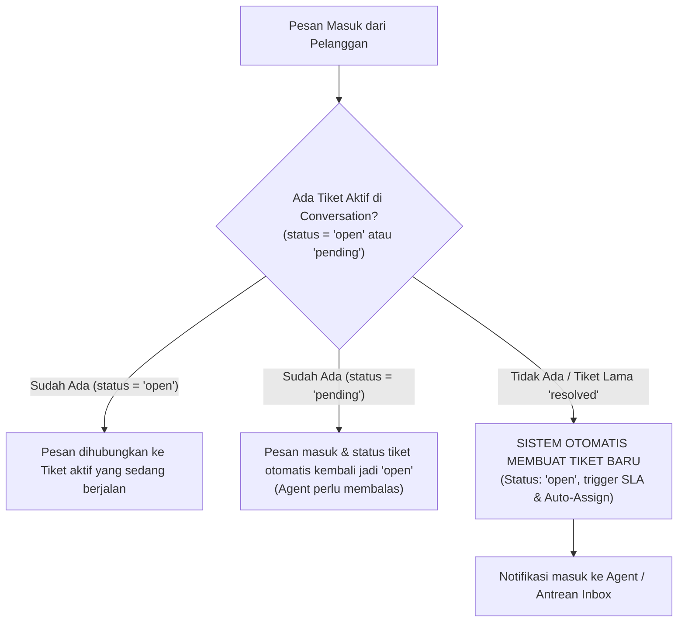
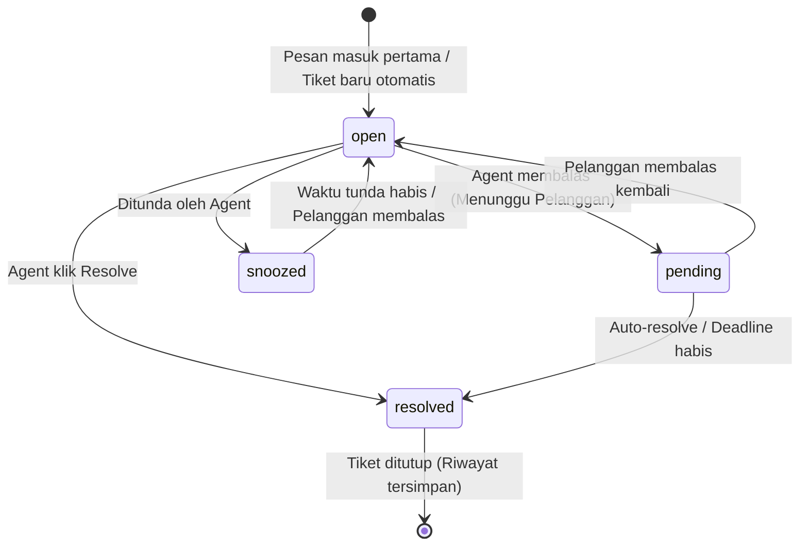

# Terminologi & Kamus Domain — Xatxoot

> **Ubiquitous Language & Domain Glossary**  
> Dokumen ini adalah acuan resmi penamaan konsep, entitas, status, kolom database, dan antarmuka untuk proyek **Xatxoot**.  
> Seluruh kode sumber (backend Hono, frontend React, skema SQL, migration, dan endpoint API) **wajib merujuk pada istilah di dokumen ini** guna menjaga konsistensi tanpa ambiguitas.

---

## 1. Prinsip Penamaan (Naming Conventions)

1. **Pemisahan `Conversation` dan `Ticket`**:
   - **`Conversation`**: Ruang/wadah obrolan berkelanjutan (*persistent chat stream*) dengan satu pelanggan di suatu Inbox (seperti satu ruang obrolan di WhatsApp).
   - **`Ticket`**: Unit kerja operasional / siklus penanganan isu dari dibuka (`open`) hingga tuntas (`resolved`). Satu `Conversation` dapat memiliki banyak riwayat `Ticket` dari waktu ke waktu.
2. **Satu Tiket = Satu Catatan Internal (1:1 Sticky Case Note)**:
   - Setiap `Ticket` hanya memiliki **tepat 1 Internal Note** yang berfungsi sebagai ringkasan kasus tersemat (*sticky note*), bukan berbentuk bubble chat yang bercampur di riwayat obrolan pelanggan.
3. **Bahasa Inggris untuk Kode & Database**: Seluruh nama tabel, kolom DB, tipe TypeScript, variabel, dan endpoint API menggunakan **Bahasa Inggris** (gaya `snake_case` untuk SQL, `camelCase` untuk TypeScript).
4. **Bahasa Indonesia / Multi-bahasa untuk Label UI**: Label yang dilihat pengguna akhir dapat diterjemahkan ke Bahasa Indonesia melalui i18n, namun di bawah layar tetap menggunakan kode identitas standar.
5. **Tunggal Organisasi (Single Organization)**: Tidak ada istilah `account` atau kolom `account_id` yang merepresentasikan multi-tenant SaaS.

---

## 2. Entitas Domain Inti (Core Entities)

| Istilah | Representasi Database / Kode | Definisi & Perilaku | Yang **TIDAK** Boleh Digunakan |
|---|---|---|---|
| **Organization** | `organizations` | Profil instalasi Xatxoot. Bersifat **singleton (selalu 1 baris)** di database. Menyimpan nama perusahaan, logo, timezone, locale default, dan pengaturan global. | ~~`Account`~~, ~~`Tenant`~~, ~~`Workspace`~~ |
| **User** | `users` | Staf, agent, atau administrator yang memiliki akun login ke dashboard Xatxoot. | ~~`Agent` (sebagai nama tabel)~~, ~~`Admin`~~, ~~`Staff`~~ |
| **Contact** | `contacts` | Entitas pelanggan atau pihak luar yang menghubungi bisnis. Menyimpan nama, nomor HP, email, custom attributes, dan riwayat obrolan. | ~~`Customer`~~, ~~`Client`~~, ~~`Lead` (sebagai entitas terpisah)~~ |
| **Company** | `companies` | Organisasi / perusahaan tempat bernaungnya Contact (untuk kebutuhan B2B). | ~~`Organization` (untuk entitas pelanggan)~~, ~~`Enterprise`~~ |
| **Inbox** | `inboxes` | Titik masuk percakapan yang menghubungkan 1 Channel tertentu ke sekelompok agent (`inbox_members`). | ~~`Channel` (sebagai pintu masuk)~~, ~~`Mailbox`~~, ~~`Room`~~ |
| **Channel** | `channels_*` | Tipe saluran komunikasi teknis (misal: WhatsApp Cloud, WhatsApp Unofficial Baileys, Web Widget, API). Setiap Inbox memiliki tepat 1 Channel. | ~~`Source`~~, ~~`Integration`~~ |
| **ContactInbox** | `contact_inboxes` | Relasi unik antara Contact dan Inbox tertentu. Menyimpan `source_id` (misalnya nomor telepon kontak atau cookie browser). | ~~`ContactChannel`~~, ~~`ChannelUser`~~ |
| **Team** | `teams`, `team_members` | Kelompok agent berdasarkan spesialisasi tugas (misal: *Customer Support*, *Sales*, *Billing*). | ~~`Workgroup`~~, ~~`Department`~~, ~~`Squad`~~ |
| **Conversation** | `conversations` | Wadah ruang obrolan persisten antara Contact dan tim Xatxoot di suatu Inbox. Menampung seluruh riwayat pesan chat yang tidak pernah terputus. | ~~`ChatRoom`~~, ~~`Thread`~~ |
| **Ticket** | `tickets` | Unit kerja operasional penanganan masalah yang menempel pada `Conversation`. Memiliki siklus hidup (`open` $\rightarrow$ `resolved`), SLA, prioritas, assignee, team, dan **1 Internal Note**. Dibuat otomatis saat pelanggan butuh balasan agent. | ~~`Case`~~, ~~`Issue`~~ |
| **Internal Note** | `tickets.internal_note` | Catatan rahasia tim yang melekat 1:1 pada tiket. Tidak pernah terkirim ke pelanggan dan tidak mengotori riwayat chat. | ~~`PrivateMessage`~~, ~~`ChatNote`~~ |
| **Message** | `messages` | Setiap satuan pesan obrolan di dalam Conversation (pesan masuk, pesan keluar, aktivitas sistem, atau template). Secara opsional mengikat `ticket_id` aktif. | ~~`ChatEntry`~~, ~~`Comment`~~ |
| **Attachment** | `attachments` | Berkas media (gambar, video, dokumen, audio/voice note) yang menempel pada suatu Message. | ~~`Media`~~, ~~`File`~~ |
| **Label** | `labels`, `ticket_labels`, `contact_labels` | Tag atau kategori warna-warni yang disematkan pada tiket atau kontak. | ~~`Tag`~~, ~~`Category`~~ |

---

## 3. Siklus Hidup & Status Tiket (Ticket Lifecycle)

### 3.1 Otomasi Pembuatan Tiket (Auto-creation Rule)

Tiket **tidak perlu dibuat manual oleh pelanggan**. Sistem mengelola tiket secara otomatis berdasarkan event pesan masuk:

1. **Ketika pesan baru masuk dari pelanggan**:
   - Jika ada tiket aktif berstatus `open`: pesan diasosiasikan ke tiket aktif tersebut.
   - Jika ada tiket aktif berstatus `pending`: status tiket otomatis kembali menjadi **`open`** (agent harus membalas kembali).
   - Jika **tidak ada tiket aktif** (atau tiket sebelumnya sudah `resolved`): sistem **otomatis membuat record `Ticket` baru** dengan status `open`, memulai *Deadline Timer*, dan memicu *Auto-assignment*.
2. **Ketika agent menyelesaikan masalah**:
   - Agent mengklik tombol **Resolve**. Tiket tersebut berubah status menjadi **`resolved`**.
   - Obrolan `Conversation` tetap utuh. Jika pelanggan mengirim chat baru di masa mendatang, sistem akan otomatis membuka tiket baru.

---

### 3.2 Status Utama Tiket (`tickets.status`)

| Status | Makna | Kondisi Terjadi |
|---|---|---|
| **`open`** | Tiket aktif yang membutuhkan balasan/tindakan dari tim agent. | Dibuat otomatis dari pesan pelanggan, atau dibuka kembali dari status `pending`/`snoozed`. |
| **`pending`** | Agent sudah membalas dan sedang menunggu tanggapan balik dari pelanggan. | Diubah otomatis setelah agent mengirim pesan balasan, atau diubah manual oleh agent. |
| **`snoozed`** | Tiket ditunda sementara sampai waktu tertentu atau sampai customer mengirim pesan baru. | Agent memilih opsi *Snooze* (misal: *Snooze until tomorrow* atau *Snooze until next reply*). |
| **`resolved`** | Masalah pada tiket ini telah tuntas diselesaikan. | Agent mengklik tombol *Resolve*, atau ditutup otomatis oleh *Auto-resolve* / *Deadline Timer*. |

---

### 3.3 Status Penugasan Tiket (Assignment State)

Status penugasan ditentukan oleh nilai `tickets.assignee_id`:

| Istilah | Kondisi Data | Makna | Yang **TIDAK** Boleh Digunakan |
|---|---|---|---|
| **Unassigned** | `assignee_id IS NULL` | Tiket berada di antrean umum inbox, belum diambil oleh agent mana pun. | ~~`Enqueued`~~, ~~`Queue`~~, ~~`Waiting`~~ |
| **Assigned** | `assignee_id IS NOT NULL` | Tiket telah ditugaskan ke salah satu agent untuk ditangani. | ~~`Claimed`~~, ~~`Taken`~~, ~~`Processing`~~ |

---

### 3.4 Prioritas Tiket (`tickets.priority`)
* `low`: Masalah berprioritas rendah.
* `medium`: Prioritas standar (default saat tiket baru dibuat).
* `high`: Membutuhkan perhatian segera.
* `urgent`: Masalah kritis / darurat.

---

### 3.5 Batas Waktu & SLA
* **Deadline Timer**: Penghitung waktu mundur (`tickets.deadline_at`) batas respons pertama atau resolusi tiket. Jika waktu habis sebelum tindakan selesai, memicu eskalasi.
* **Auto-Resolve**: Tindakan sistem menutup tiket secara otomatis jika kontak tidak merespons selama durasi tertentu ($N$ jam/hari).

---

### 3.6 Catatan Internal Tiket (Internal Note — 1:1 Sticky Case Note)

* **Hubungan 1-to-1**: Setiap `Ticket` hanya memiliki **maksimal 1 Internal Note** yang disimpan di tabel `tickets` (`internal_note`, `internal_note_updated_by`, `internal_note_updated_at`).
* **Bukan Bubble Chat**: Internal note **tidak lagi disimpan sebagai bubble chat** di riwayat obrolan pelanggan (`messages`), melainkan ditampilkan sebagai **kartu ringkasan tersemat (*sticky note card*)** di Context Drawer Kanan atau di Header Tiket.
* **Fungsi Utama**:
  1. **Ringkasan Kasus (*Case Summary*)**: Memberikan konteks instan bagi agent berikutnya saat terjadi operan shift (*handover*) atau eskalasi ke supervisor tanpa perlu membaca puluhan pesan chat.
  2. **Kolaborasi & @mention**: Agent dapat mengetik `@nama_agent` untuk memanggil rekan kerja; saat note disimpan, sistem memicu notifikasi ke agent terkait.
  3. **Zero Risk of Leak**: Menghilangkan 100% risiko agent salah mengirim catatan internal ke pelanggan karena form input catatan terpisah dari form chat obrolan.

---

## 4. Tipe Pesan & Komunikasi (Messages)

### 4.1 Tipe Pengirim (`messages.sender_type`)
* `user`: Dikirim oleh agent/admin yang login di dashboard.
* `contact`: Dikirim oleh pelanggan dari channel luar.
* `bot`: Dikirim oleh Flow-based Bot atau sistem otomatis.
* `system`: Pesan aktivitas sistem (misal: *"Tiket #102 dibuat otomatis"*, *"Andi menyelesaikan Tiket #101"*).

### 4.2 Sifat Pesan & Visibilitas
| Istilah | Properti DB | Keterangan | Tampilan UI |
|---|---|---|---|
| **Incoming Message** | `message_type: 'incoming'` | Pesan masuk dari pelanggan. | Bubble putih (`#ffffff`), ekor kiri |
| **Outgoing Message** | `message_type: 'outgoing'` | Pesan balasan resmi dari agent ke pelanggan. | Bubble hijau muda (`#d9fdd3`), ekor kanan |
| **Activity Message** | `message_type: 'activity'` | Catatan pemisah tiket atau audit sistem dalam alur obrolan. | Text pill abu-abu di tengah |
| **Template Message** | `message_type: 'template'` | Pesan WhatsApp HSM yang disetujui Meta. | Bubble dengan footer status template |

### 4.3 Status Pengiriman Pesan (`messages.status`)
* `sent`: Pesan berhasil keluar dari server Xatxoot menuju provider channel. *(1 centang abu-abu)*
* `delivered`: Pesan telah diterima di perangkat penerima. *(2 centang abu-abu)*
* `read`: Pesan telah dibaca/dibuka oleh penerima. *(2 centang biru)*
* `failed`: Pengiriman gagal (misalnya nomor tidak terdaftar atau di luar 24 jam). *(Tanda seru merah)*

---

## 5. Saluran Komunikasi & Ekosistem WhatsApp

| Istilah | Definisi Teknis |
|---|---|
| **WhatsApp Cloud API** | Provider resmi WhatsApp via Meta Graph API v18.0+. Menggunakan token resmi, WABA ID, dan Phone Number ID. |
| **WhatsApp Unofficial Gateway** | Provider alternatif berbasis emulasi WhatsApp Web multi-device (library **Baileys** di service `apps/wa-gateway` dengan runtime **Node.js LTS**) menggunakan mekanisme scan QR code / pairing code. |
| **WABA (WhatsApp Business Account)** | Akun bisnis resmi di Meta Business Manager yang menaungi nomor telepon WhatsApp API. |
| **Phone Number ID** | ID unik nomor telepon di Meta Graph API yang digunakan untuk mengirim/menerima pesan. |
| **24-Hour Customer Care Window** | Kebijakan Meta: Bisnis bebas mengirim pesan non-template selama 24 jam sejak pesan terakhir dari pelanggan. Di luar jendela ini, bisnis **wajib** menggunakan Template HSM. |
| **Message Template (HSM)** | Format pesan bisnis resmi berbayar yang telah disetujui Meta (*Highly Structured Message*). Mendukung variabel dinamis `{{1}}`, header gambar/dokumen, dan tombol *Quick Reply* / *Call to Action*. |
| **Interactive Message** | Pesan WhatsApp yang memiliki tombol interaktif (*Button Reply*) atau menu daftar pilihan (*List Menu*). |
| **Webhook Verifier** | Mekanisme verifikasi webhook Meta: handshake validasi token `hub.verify_token` dan verifikasi integritas signature SHA-256 (`x-hub-signature-256`). |
| **WhatsApp Cloud API Simulator** | Service tiruan (`apps/wa-simulator`) untuk mengemulasi Meta Graph API v18.0+ dan webhook secara 100% offline saat development & automated testing tanpa perlu akun Meta sungguhan. |

---

## 6. Alat Produktivitas & Otomasi (Productivity & Bots)

| Istilah | Definisi | Sintaks / Pemicu |
|---|---|---|
| **Canned Response** | Template jawaban teks cepat yang telah disimpan sebelumnya. | Dipanggil dengan mengetik `/` diikuti `short_code` di composer chat. |
| **External Slash Command** | Perintah yang memicu pemanggilan HTTP webhook eksternal secara dinamis untuk mengambil data real-time (misal: cek ongkir, status order). | Dipanggil dengan mengetik `/nama_command [parameter]` di composer chat. |
| **Macro** | Rangkaian beberapa tindakan yang dieksekusi sekaligus dalam satu klik (misal: *tambah label 'Billing' + tugaskan ke 'Finance' + ubah status ke 'Resolved'*). | Tombol aksi Macro di toolbar percakapan. |
| **Flow-Based Chatbot Engine** | Bot deterministik berbasis diagram alur (decision tree) dengan node aksi (`send_message`, `user_input`, `branch_condition`, `http_request`, `assign_agent_or_team`, `end_flow`). | Berjalan di Fase 2 sebagai bot garis depan (tier-1) sebelum AI Fase 5. |
| **Bot Handoff** | Tindakan bot mengalihkan tiket ke staf/agent manusia setelah flow selesai atau ketika pelanggan meminta bantuan agent. | Node `assign_agent_or_team` pada flow bot. |
| **Round-Robin Auto-Assign** | Algoritma penugasan tiket baru secara bergiliran dan merata hanya kepada agent yang berstatus `online`. | Setting Inbox: `enable_auto_assign: true`. |

---

## 7. Peran Pengguna & Akses (RBAC)

### 7.1 Peran Sistem (`users.role`)
* **`owner`**: Administrator utama / pembuat instalasi pertama. Memiliki hak penuh atas konfigurasi server, backup, upgrade instance, dan seluruh data.
* **`administrator`**: Pengelola tim support. Dapat mengelola inbox, tim, template pesan, aturan otomasi, dan melihat laporan analitik.
* **`agent`**: Staf customer service yang bertugas membalas tiket percakapan, mengelola kontak, dan menggunakan fitur produktivitas.

### 7.2 Status Ketersediaan Staf (`users.availability`)
* **`online`**: Siap menerima dan membalas tiket (dapat menerima penugasan auto-assign).
* **`offline`**: Tidak aktif / sedang tidak bertugas.
* **`busy`**: Sedang menangani tiket intensif / tidak menerima auto-assign baru.

### 7.3 Autentikasi & Single Sign-On (SSO)
* **Google OAuth SSO (Fase 0)**: Autentikasi sekali klik untuk staf/agent menggunakan akun Google Workspace kantor (mendukung filter pembatasan domain email perusahaan via `GOOGLE_ALLOWED_DOMAINS`).
* **Email & Password**: Login standar menggunakan password hashing Argon2id + Session JWT / secure httpOnly cookie.
* **MFA (Multi-Factor Authentication)**: Autentikasi 2 langkah berbasis aplikasi authenticator TOTP (Google Authenticator / Authy).
* **Enterprise SSO (Fase 5)**: Integrasi direktori korporat menggunakan protokol SAML 2.0 & OIDC.

---

## 8. Desain Antarmuka & UX (WhatsApp Web-Inspired)

* **Astryx by Meta (`astryx.atmeta.com`)**: Pustaka komponen UI primitif (React 19) yang battle-tested, accessible, dan agent-friendly. Digunakan sebagai pondasi tombol, dialog, popover, tabs, dan form input.
* **Layout 3.5 Kolom**:
  1. *Nav Rail* (60px fixed): Navigasi ikon modul utama.
  2. *Chat List Panel* (360px - 400px): Daftar percakapan bergaya list WhatsApp Web lengkap dengan filter unread & tag. Setiap item menampilkan badge status tiket aktif (misal: `#T-102 [Open]`).
  3. *Conversation Thread* (Area Utama): Kanvas obrolan berdoodle dengan bubble bertail. Bersih 100% dari bubble catatan internal. Pemisah antar-tiket ditandai dengan pill aktivitas.
  4. *Context CRM Drawer* (Slide-over kanan): Detail kontak, atribut custom, **Kartu Catatan Internal Tiket (*Sticky Case Note*)**, dan **Riwayat Tiket Terdahulu** (*Ticket History*).
* **Doodle Canvas**: Latar belakang bermotif halus khas WhatsApp (`#efeae2` light, `#0b141a` dark).
* **Double-Tick Indicator**: Ikon centang dinamis status pengiriman pesan (jam pending $\rightarrow$ 1 abu $\rightarrow$ 2 abu $\rightarrow$ 2 biru).

---

## 9. Matriks Padanan Istilah (Anti-Patterns / DOs & DON'Ts)

Tabel berikut menjadi panduan tegas agar developer **tidak mencampur istilah lama/lain**:

| Gunakan Istilah Ini (DO) ✅ | JANGAN Gunakan (DON'T) ❌ | Alasan |
|---|---|---|
| `conversations` | `chat_rooms`, `threads` | `Conversation` adalah wadah stream percakapan abadi kontak di inbox. |
| `tickets` | `cases`, `issues` | `Ticket` adalah siklus unit kerja operasional (`open` $\rightarrow$ `resolved`) di dalam `conversation`. |
| `tickets.internal_note` | `messages.private`, `private_notes` | Catatan internal adalah entitas 1-to-1 sticky note pada tiket, bukan bubble pesan chat. |
| `teams` | `workgroups`, `departments`, `squads` | Menjaga keseragaman pengelompokan agent. |
| `open` (unassigned) | `enqueued`, `in_queue`, `queued` | Antrean ditentukan oleh `tickets.status = 'open' AND tickets.assignee_id IS NULL`. |
| `organizations` | `accounts`, `tenants`, `workspaces` | Xatxoot adalah self-hosted single-organization, tidak memerlukan multi-tenant scoping. |
| `contacts` | `customers`, `clients`, `visitors` | `Contact` adalah entitas master pelanggan. |
| `canned_responses` | `quick_replies` (untuk canned), `macros` | `quick_replies` di WhatsApp merujuk ke interactive buttons; balasan cepat teks adalah `canned_responses`. |
| `message_type = 'incoming'` | `inbound`, `from_customer` | Standar enum pesan. |
| `message_type = 'outgoing'` | `outbound`, `from_agent` | Standar enum pesan. |
| `assignee` | `owner` (pada tiket), `handled_by` | Menghindari bentrok istilah dengan peran sistem `owner` (operator instance). |
